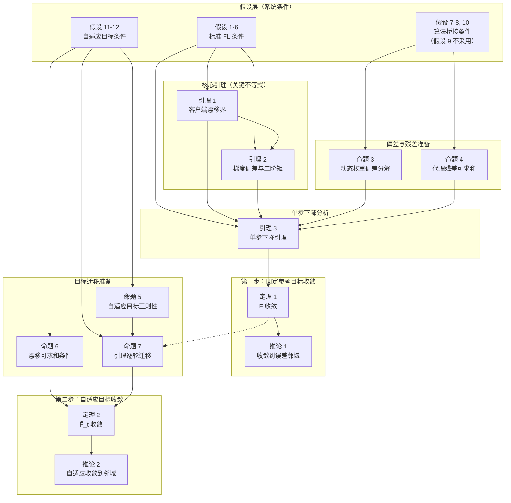

# 基于部分遗忘补偿的联邦学习（FL-PFC）严格收敛性分析

> **适用对象**：通信工程及相关专业本科生，具备高等数学（微积分、线性代数、概率论）和信号与系统/数字信号处理基础。
>
> **文档说明**：本文从通信专业学生的视角出发，用信号处理的类比（噪声、偏差、衰减、稳态等）来理解联邦学习的收敛性证明。每一节先给出直观理解，再进入严格推导。

---

## 论文结构概览

本分析采用**两步递进**结构：

- **第一步**（定理 1）：先在一个"简化版"的固定目标函数 $F$ 上证明算法的收敛性。这类似于信号处理中先在无噪声的理想信道下分析系统性能，再考虑实际信道。
- **第二步**（定理 2）：将结论推广到算法真正使用的、每轮都在变化的"自适应目标函数" $\widetilde{F}_t$。这相当于将理想信道的结果推广到实际时变信道。

在阅读本文时，请始终区分两个分析对象：

| 符号 | 含义 | 类比 |
|------|------|------|
| $F_k, F$ | 时间均匀的固定参考目标（替代目标） | 理想信道的系统模型 |
| $\widetilde{F}_{k,t}, \widetilde{F}_t$ | 冻结了当前轮次自适应状态后的实际逐轮目标 | 实际时变信道的系统模型 |

---

## 证明结构总览

下图展示全文各组件之间的逻辑依赖关系。实线箭头表示"依赖/用于证明"，虚线箭头表示"条件传递"。你可以把它理解为系统框图中各模块之间的信号流关系。



### 阅读路线建议

| 遍次 | 路线 | 理解目标 |
|------|------|---------|
| **第一遍**（主干） | H1 → 引理 1 → 引理 2 → 引理 3 → 定理 1 → 推论 1 | 理解核心收敛逻辑："梯度下降为什么能让损失函数减小" |
| **第二遍**（完整第一段） | 主干 + H2 → 命题 3/4 → 引理 3 | 加入偏差与残差的影响："不完美条件下算法依然能收敛" |
| **第三遍**（完整） | 全部路线 + H3 → 命题 5/6/7 → 定理 2 → 推论 2 | 理解最终结论："自适应目标下算法也收敛" |

---

## 基础知识：证明中用到的核心数学工具

在进入正文之前，我们先回顾几个贯穿全文的数学工具。如果你对这些已经很熟悉，可以跳过本节。

### 1. 范数不等式（Cauchy-Schwarz 和它的变体）

对于向量 $a, b$，有 $\|a + b\|^2 \le 2\|a\|^2 + 2\|b\|^2$。这是一个非常常用的放缩技巧——当我们无法直接处理两个向量的和时，可以把它们拆开，各自处理。

更一般地：$\|\sum_{i=1}^n x_i\|^2 \le n \sum_{i=1}^n \|x_i\|^2$。这是 Cauchy-Schwarz 不等式的直接推论。

### 2. Young 不等式（Peter-Paul 不等式）

对任意 $\alpha > 0$：

$$\langle a, b \rangle \le \frac{\alpha}{2}\|a\|^2 + \frac{1}{2\alpha}\|b\|^2$$

**直观理解**：两个向量的内积可以被拆分成各自的范数平方的加权和。参数 $\alpha$ 可以自由调节，用来平衡两项的大小。这在证明中非常有用——我们可以把"麻烦"的交叉项转化为各自独立的平方项。

### 3. $L$-平滑性（$L$-smoothness）

函数 $F$ 被称为 $L$-平滑的，如果其梯度满足：

$$\|\nabla F(x) - \nabla F(y)\| \le L \|x - y\|$$

**直观理解**：梯度不能变化得太快——变化速率被 $L$ 这个常数限制住了。在信号处理中，这类似于低通滤波器的带宽限制：信号的变化率有上限。$L$ 越大，函数越"陡峭"；$L$ 越小，函数越"平缓"。

### 4. Jensen 不等式

对于凸函数 $\varphi$：$\varphi(\mathbb{E}[X]) \le \mathbb{E}[\varphi(X)]$。

我们最常用的形式是取 $\varphi(x) = \|x\|^2$：$\|\mathbb{E}[X]\|^2 \le \mathbb{E}[\|X\|^2]$。

**直观理解**：先求期望再取范数，小于等于先取范数再求期望。因为期望是一个"平均"操作，它会"抹平"掉一些波动。

---

## 第一部分：算法对齐的代理模型与精确更新

### 背景知识：联邦学习中的挑战

在联邦学习中，多个客户端（如手机、传感器节点）各自持有本地数据，需要协作训练一个共享模型。核心挑战有三个：

1. **数据异质性**：每个客户端的数据分布不同（想象不同地区的传感器采集的数据有不同的统计特性），这导致各客户端的"最优方向"不同。
2. **部分参与**：每轮通信只有部分客户端被选中参与训练（类似时分多址 TDMA 中每个时隙只有部分用户传输）。
3. **代理知识蒸馏**：本算法使用"代理模型"来补偿遗忘问题。

### 1.1 本地目标函数

对于第 $t$ 轮通信的客户端 $k$，它要优化的本地目标函数为：

$$\widetilde{\mathcal{L}}_t^k(\omega;\omega_t,\omega_t^{proxy},W_{r,t}^k,\lambda_t^k,\mu_t) = \mathcal{L}_C^k(\omega) + \lambda_t^k\mathcal{L}_{\mathcal{KD}}^k(\omega) + \frac{\mu_t}{2}\|\omega-\omega_t\|^2 \tag{1}$$

其中各项的含义如下：

| 项 | 含义 | 通信专业类比 |
|----|------|-------------|
| $\mathcal{L}_C^k(\omega)$ | 第 $k$ 个客户端的**分类损失**（基本任务） | 信号的有用分量 |
| $\lambda_t^k \mathcal{L}_{\mathcal{KD}}^k(\omega)$ | **知识蒸馏损失**，用于从代理模型继承知识 | 从参考信号中提取的先验信息 |
| $\frac{\mu_t}{2}\|\omega - \omega_t\|^2$ | **近端项**（Proximal Term），防止本地模型偏离全局模型太远 | 负反馈控制中的**限幅器** |

> **直观解释**：近端项的作用类似于控制理论中的**比例-积分控制器（PI 控制器）中的比例项**——当本地模型偏离全局模型 $\omega_t$ 太远时，它会施加一个"拉力"把模型拽回来。$\mu_t$ 就是这个拉力的强度系数。

### 1.2 两个分析对象

因为自适应参数（$\lambda_t^k, \mu_t$ 等）每轮都会变化，目标函数实际上也在每轮变化。为了分析方便，我们定义两个分析对象：

**分析对象一：冻结的逐轮期望目标（算法真正优化的对象）**

$$\widetilde{F}_{k,t}(\omega) \triangleq \mathbb{E}_{\xi\sim\mathcal{D}_k}\left[\widetilde{\mathcal{L}}_t^k(\omega;\omega_t,\omega_t^{proxy},W_{r,t}^k,\lambda_t^k,\mu_t;\xi)\right] \tag{2}$$

$$\widetilde{F}_t(\omega) \triangleq \sum_{k=1}^{K} p_k \widetilde{F}_{k,t}(\omega) \tag{3}$$

这里 $p_k = \frac{n_k}{n}$ 是客户端 $k$ 的数据量占比（$n_k$ 是客户端 $k$ 的本地样本数，$n$ 是总样本数）。式 (3) 是把所有客户端的期望目标按数据量加权平均，得到全局期望目标。

**分析对象二：时间均匀的参考代理目标（用于第一步定理的固定基线）**

$$F(\omega) = \sum_{k=1}^{K} p_k F_k(\omega) \tag{4}$$

$F_k$ 是一个时间不变的参考函数，可以理解为把自适应参数"冻结"在某个标准值后得到的目标函数。

> **类比**：这类似于通信系统中先分析 AWGN 信道下的性能，再推广到衰落信道。$F$ 相当于 AWGN 信道模型，$\widetilde{F}_t$ 相当于实际衰落信道模型。

### 1.3 梯度符号体系

以下符号在全文统一使用，请务必记住：

| 符号 | 定义 | 含义 |
|------|------|------|
| $g_{t,e}^k$ | 客户端 $k$ 在第 $t$ 轮本地更新第 $e$ 步时使用的随机梯度 | 单步的"导航信号" |
| $\bar{g}_t^k$ | $\frac{1}{E}\sum_{e=0}^{E-1} g_{t,e}^k$ | 客户端 $k$ 做完 $E$ 步本地更新后的平均梯度 |
| $g_t$ | $\sum_{k=1}^{K} p_k \bar{g}_t^k$ | **理想的全参与梯度**（假设所有客户端都参与，且按原始比例加权） |

式 (5) 中的 $g_t$ 是一个"理想量"——在现实中我们无法获得，因为每轮只有部分客户端参与。但它作为参照基准非常有用。

### 1.4 动态权重与代理调度规则

联邦学习在实际运行中，每轮只会采样部分客户端参与训练。此外，本算法还引入了一个"代理客户端"（proxy client）。具体规则如下：

**动态权重规则**（决定各参与客户端的权重分配）：

$$\gamma_t^k = \frac{e^{u_{t+1}^k - v_t^k}}{\sum_{j\in S_t} e^{u_{t+1}^j - v_t^j}}, \qquad k\in S_t \tag{6}$$

这里 $S_t$ 是第 $t$ 轮被选中参与训练的客户端集合。权重 $\gamma_t^k$ 通过 softmax 归一化，确保 $\sum_{k\in S_t} \gamma_t^k = 1$。

**代理调度规则**（控制代理模型的参与程度）：

$$\gamma_t^{proxy} = \bar{C}_\gamma (t+1)^{-(1+\rho)}, \qquad \rho > 0 \tag{7}$$

$\gamma_t^{proxy}$ 是代理客户端的权重。注意它按 $t^{-(1+\rho)}$ 衰减——随着训练进行，代理模型的贡献越来越小。$\rho$ 是衰减指数，由算法设计者设定，$\rho$ 越大衰减越快。

**规范化聚合权重**：将原始权重 $w_t^i = \pi_i \gamma_t^i$（$\pi_i$ 是客户端 $i$ 的数据量占比）归一化：

$$\alpha_{k,t} \triangleq \begin{cases} \dfrac{\pi_k\gamma_t^k}{\sum_{j\in S_t\cup proxy}\pi_j\gamma_t^j}, & k\in S_t \\[1.2ex] 0, & k\notin S_t \end{cases} \tag{9}$$

$$\beta_t \triangleq \frac{\pi_{proxy}\gamma_t^{proxy}}{\sum_{j\in S_t\cup proxy}\pi_j\gamma_t^j} \tag{9}$$

$\alpha_{k,t}$ 是真实客户端 $k$ 在第 $t$ 轮的实际聚合权重。$\beta_t$ 是代理模型的权重。$\alpha_{k,t}$ 和 $\beta_t$ 满足 $\sum_k \alpha_{k,t} + \beta_t = 1$。

### 1.5 偏差与残差定义

为了将实际更新过程拆解为"理想更新 + 误差项"的形式，我们定义两个关键量：

$$d_t \triangleq \sum_{k=1}^{K} \alpha_{k,t}\bar{g}_t^k, \qquad b_t \triangleq d_t - g_t, \qquad r_t \triangleq \beta_t(\omega_t^{proxy} - \omega_t) \tag{10}$$

| 符号 | 含义 | 通信类比 |
|------|------|---------|
| $d_t$ | 实际聚合梯度（含动态权重，只对参与客户端求和） | 实际接收到的信号 |
| $b_t = d_t - g_t$ | 动态权重 + 部分参与导致的**偏差** | 接收信号与理想信号的差值 |
| $r_t = \beta_t(\omega_t^{proxy} - \omega_t)$ | 代理模型引入的**残差项**（在模型空间操作） | 已知的参考信号修正量 |

### 1.6 条件约定

记 $\mathcal{F}_t$ 为第 $t$ 轮开始时的"已知信息集合"（在概率论中称为 $\sigma$-域），包括：
- 当前的服务器模型 $\omega_t$
- 该轮的自适应参数 $\lambda_t^k, \mu_t$
- 代理模型 $\omega_t^{proxy}$
- 辅助状态 $W_{r,t}^k$

定义条件期望符号：$\mathbb{E}_t[\cdot] \triangleq \mathbb{E}[\cdot \mid \mathcal{F}_t]$，即"在已知本轮开始时所有信息的条件下求期望"。

> **重要说明**：动态权重 $\gamma_t^k$ 依赖于本地更新的结果 $u_{t+1}^k$，因此残差项 $r_t$ 不能认为是 $\mathcal{F}_t$ 已知的。在证明中，$r_t$ 的贡献只能通过其条件二阶矩 $\mathbb{E}_t\|r_t\|^2$ 来界定。

### 1.7 服务器更新的精确分解——全文最核心的公式

**本地 SGD 更新**：每个参与客户端从 $\omega_t$ 出发，执行 $E$ 步随机梯度下降：

$$\omega_{t,e+1}^k = \omega_{t,e}^k - \eta_t g_{t,e}^k, \qquad \omega_{t,0}^k = \omega_t$$

经过 $E$ 步，得到本地更新后的模型：

$$\omega_{t+1}^k = \omega_t - \eta_t E \bar{g}_t^k \tag{11}$$

**服务器聚合**：服务器收集各客户端的更新结果，按权重 $\alpha_{k,t}$ 和 $\beta_t$ 聚合：

$$\begin{aligned} \omega_{t+1} &= \sum_{k\in S_t}\alpha_{k,t}\omega_{t+1}^k + \beta_t\omega_t^{proxy} \\[4pt] &= \sum_{k\in S_t}\alpha_{k,t}\left(\omega_t - \eta_t E\bar{g}_t^k\right) + \beta_t\omega_t^{proxy} \\[4pt] &= \left(\sum_{k=1}^{K}\alpha_{k,t}\right)\omega_t - \eta_t E \underbrace{\sum_{k=1}^{K}\alpha_{k,t}\bar{g}_t^k}_{=\,d_t} + \beta_t\omega_t^{proxy} \end{aligned}$$

由于 $\sum_{k=1}^{K} \alpha_{k,t} = 1 - \beta_t$（权重归一化），且 $d_t = g_t + b_t$（由式 (10)），代入得：

$$\begin{aligned} \omega_{t+1} &= (1 - \beta_t)\omega_t - \eta_t E(g_t + b_t) + \beta_t\omega_t^{proxy} \\[4pt] &= \omega_t - \eta_t E(g_t + b_t) + \beta_t(\omega_t^{proxy} - \omega_t) \\[4pt] &= \omega_t - \eta_t E(g_t + b_t) + r_t \end{aligned}$$

$$\boxed{\omega_{t+1} = \omega_t - \eta_t E(g_t + b_t) + r_t} \tag{12}$$

> **这是全文最重要的公式**。它将服务器模型的更新分解为三个组成部分：
>
> 1. **$-\eta_t E g_t$**：**理想的全参与梯度下降项**。如果所有客户端都参与且权重正确，这就是我们想要的更新方向。类比通信中的"期望信号"。
>
> 2. **$-\eta_t E b_t$**：**偏差项**，来源于我们只能采样部分客户端，且动态权重 $\alpha_{k,t}$ 不等于理想权重 $p_k$。类比通信中的"系统性失真"。
>
> 3. **$r_t = \beta_t(\omega_t^{proxy} - \omega_t)$**：**代理模型残差项**，来源于代理模型的直接贡献（不是通过梯度，而是直接在模型空间上修正）。由于 $\beta_t$ 按 $t^{-(1+\rho)}$ 衰减，这项随时间减小。类比通信中的"已知干扰"。

**统一常数约定**：为简化后续推导，定义统一常数：

$$c_g \triangleq 4\max\left\{1+8L^2\bar{\eta}^2E^2,\; M(1+8L^2\bar{\eta}^2E^2)\right\} \tag{13}$$

其中 $\bar{\eta}$ 是学习率的上界（$\eta_t \le \bar{\eta}$ 对所有 $t$ 成立）。$c_g$ 是一个时间均匀常数，特别注意 $c_g \ge 4M$。

> **$c_g$ 的构造动机**：在引理 2 中，我们需要将梯度 $g_t$ 的二阶矩统一表示为 $\sigma_l^2 + \kappa^2 + \|\nabla F(\omega_t)\|^2$ 的线性组合。$c_g$ 中的 `4` 来自 $A_t = 2\sigma_l^2 + 4\kappa^2 + 4M\|\nabla F\|^2$ 与 $(1+8L^2\eta_t^2E^2)$ 的乘积放缩。`max` 内的两项分别应对 $M \ge 1$ 和 $M < 1$ 两种情形。

---

## 第二部分：假设条件

**在正式进入推导之前，我们先列出所有分析所需的前提假设。** 这些假设就像是通信系统的"技术规格书"——定义了分析有效的工作条件。每个假设后面都附有通信专业的类比解释。

### 2.1 标准 FL 条件

**假设 1（平滑性与下界）**：每个客户端的参考目标函数 $F_k$ 是可微的，且梯度满足 $L$-平滑性：$\|\nabla F_k(x) - \nabla F_k(y)\| \le L\|x - y\|$。全局目标函数 $F = \sum_k p_k F_k$ 有下界，即 $F_{\inf} \triangleq \inf_{\omega} F(\omega) > -\infty$。

> **通信类比**：$L$-平滑性类似于低通滤波器的截止频率——限制函数的"变化速率"。有下界保证目标函数不会发散到负无穷（类似于通信系统中接收信号功率不会无穷小）。

**假设 2（条件无偏性）**：在给定当前轮已知信息 $\mathcal{F}_t$ 和当前模型 $\omega_{t,e}^k$ 的条件下，随机梯度是真梯度的无偏估计：

$$\mathbb{E}\left[g_{t,e}^k \mid \mathcal{F}_t, \omega_{t,e}^k\right] = \nabla F_k(\omega_{t,e}^k)$$

> **通信类比**：这类似于"信道估计是无偏的"——估计量的期望等于真实值。无偏性保证了平均来看我们的更新方向是正确的。

**假设 3（有界自适应系数）**：所有自适应参数保持在有界范围内：
- $0 \le \lambda_t^k \le \lambda_{\max}$（蒸馏损失的权重不会无限增大）
- $0 \le \mu_t \le \mu_{\max}$（近端项的强度不会无限增大）
- $\omega_t^{proxy}$ 和 $W_{r,t}^k$ 保持在有界集合内

实际实现中可以通过投影截断来实现：$\lambda_t^k = \Pi_{[0,\lambda_{\max}]}(\widehat{\lambda}_t^k)$，即如果计算出的值超出范围就把它裁剪回边界。这类似于通信中的**限幅器**（clipper）。

**假设 4（组件损失的正则性）**：分类损失 $\mathcal{L}_C^k$ 和蒸馏损失 $\mathcal{L}_{\mathcal{KD}}^k$ 都是平滑的，且蒸馏损失在允许范围内一致有界：$0 \le \mathcal{L}_{\mathcal{KD}}^k \le M_{\mathcal{KD}}$。

> **通信类比**：蒸馏损失有界意味着它的"能量"有限——类似于通信信号有最大发射功率限制。

**假设 5（有界本地方差）**：

$$\mathbb{E}\left[\|g_{t,e}^k - \nabla F_k(\omega_{t,e}^k)\|^2 \mid \mathcal{F}_t, \omega_{t,e}^k\right] \le \sigma_l^2$$

> **通信类比**：$\sigma_l^2$ 类似于信道中的**加性高斯白噪声（AWGN）方差**。随机梯度中的随机性来自小批量采样的随机性，其波动程度被 $\sigma_l^2$ 约束。

**假设 6（有界数据异质性）**：存在常数 $M \ge 1$ 和 $\kappa \ge 0$，使得对所有 $\omega$：

$$\sum_{k=1}^{K} p_k\|\nabla F_k(\omega)\|^2 \le \kappa^2 + M\|\nabla F(\omega)\|^2 \tag{15}$$

> **通信类比**：这量化了各客户端的"数据分布差异"。$\kappa$ 类似于多用户系统中的**常值频偏**——即使用户静止，也有固定的频率偏移；$M$ 类似于**比例频偏系数**，控制梯度范数之间的缩放关系。当所有客户端数据分布完全相同时，$\kappa = 0$ 且 $M = 1$。

**假设 7（非空参与与正客户端质量）**：每轮至少有一个客户端参与（$S_t \neq \varnothing$），每个客户端的原始权重至少为 $\pi_{\min} > 0$。

### 2.2 算法特定的桥接条件

**假设 8（有界平均客户端梯度）**：存在常数 $G > 0$，使得对所有客户端和所有轮次，$\|\bar{g}_t^k\| \le G$（几乎必然成立）。

> **通信类比**：每个客户端的"信号幅度"有上限。这类似于每个发射机的最大发射功率限制。

**假设 9（动态权重偏差衰减——本文不采用）**：某些联邦学习分析会假定存在 $C_{\alpha} > 0$ 和 $\nu > 0$，使得权重偏差 $\|\alpha_t - p\|_1^2 \le C_{\alpha}(t+1)^{-2\nu}$ 随轮次衰减。

> **本文立场**：我们认为这一假设在实践中通常难以满足——联邦学习中每轮随机采样有限数量的客户端，仅凭采样本身无法保证权重的系统偏差以多项式速率衰减到零。因此，**本文的分析不依赖假设 9**，仅使用命题 3 给出的常数上界 $\|b_t\| \le 2G$。这意味着：收敛结果将维持在某个与 $G^2$ 成正比的非零邻域（即"误差地板"），而非收敛到零。

**假设 10（有界代理间隙）**：代理模型与服务器模型之间的距离始终有限：

$$\sup_t \|\omega_t^{proxy} - \omega_t\| \le R_{\beta}$$

> **通信类比**：这类似于"参考信号与主信号之间的相位差有上限"。

### 2.3 使桥接假设自然成立的充分条件

**命题 1（紧状态的充分条件）**：如果存在一个紧集（有界闭集合）$\mathcal{K}_{\omega}$ 包含所有模型参数 $\omega_t, \omega_{t,e}^k, \omega_t^{proxy}$，且随机梯度在紧集上连续，则假设 8 和假设 10 自动成立。

**证明思路**：有限数据集只有有限种小批量采样组合，连续函数在紧集上必能达到最大值。取所有可能的小批量中梯度范数的最大值作为 $G$ 即可。代理间隙 $R_{\beta}$ 取紧集 $\mathcal{K}_{\omega}$ 的直径（最大距离）。

**命题 2（投影状态机制）**：如果算法实现时使用欧氏投影将模型参数限制在紧集 $\mathcal{K}_{\omega}$ 内，并使用投影截断 $\lambda_t^k = \Pi_{[0,\lambda_{\max}]}(\widehat{\lambda}_t^k)$，则假设 3、假设 8 和假设 10 自然成立。

> **实践意义**：工程师在实现时可以简单地用一个**投影操作**来确保算法不超出安全范围，类似于通信系统中的AGC（自动增益控制）。

---

## 第三部分：偏差与残差的代数分解

### 背景理解

回顾式 (12)：$\omega_{t+1} = \omega_t - \eta_t E(g_t + b_t) + r_t$。我们需要对偏差 $b_t$ 和残差 $r_t$ 进行定量分析——它们到底有多大？有多大的"坏影响"？

### 3.1 动态权重的偏差-方差分解（命题 3）

**命题 3**：在假设 7 和假设 8 下：

$$\|b_t\| = \left\|\sum_{k=1}^{K}(\alpha_{k,t} - p_k)\bar{g}_t^k\right\| \le 2G \tag{17}$$

**详细推导**：

首先，$\alpha_{k,t} \ge 0$ 且根据归一化性质：

$$\sum_{k=1}^{K}\alpha_{k,t} = \frac{\sum_{k\in S_t}\pi_k\gamma_t^k}{\sum_{j\in S_t\cup proxy}\pi_j\gamma_t^j} = 1 - \beta_t \le 1 \tag{18}$$

因为 $\sum_k p_k = 1$，有：

$$\sum_{k=1}^{K}|\alpha_{k,t} - p_k| \le \sum_{k=1}^{K}\alpha_{k,t} + \sum_{k=1}^{K} p_k \le 1 + 1 = 2 \tag{19}$$

然后利用假设 8（$\|\bar{g}_t^k\| \le G$）：

$$\|b_t\| \le \sum_{k=1}^{K}|\alpha_{k,t} - p_k| \cdot \|\bar{g}_t^k\| \le G \cdot \sum_{k=1}^{K}|\alpha_{k,t} - p_k| \le 2G$$

**偏差的进一步分解**：将 $b_t$ 分解为"确定性偏差"加"随机波动"两部分（类似于信号中的直流分量加交流分量）：

- **系统性偏差**：$m_t \triangleq \mathbb{E}_t[b_t]$（$b_t$ 的条件期望，称为"系统性偏差"）
- **随机波动**：$\zeta_t \triangleq b_t - m_t$（期望为 0 的随机分量）

显然 $b_t = m_t + \zeta_t$，$\mathbb{E}_t[\zeta_t] = 0$。对这两部分有界：

$$\|m_t\|^2 \le 4G^2, \qquad \mathbb{E}_t\|\zeta_t\|^2 \le 4G^2 \tag{20}$$

> **推导细节**：由 Jensen 不等式，$\|m_t\|^2 = \|\mathbb{E}_t[b_t]\|^2 \le \mathbb{E}_t\|b_t\|^2 \le 4G^2$。
> 对于波动项：$\mathbb{E}_t\|\zeta_t\|^2 = \mathbb{E}_t\|b_t - \mathbb{E}_t[b_t]\|^2 = \mathbb{E}_t\|b_t\|^2 - \|\mathbb{E}_t[b_t]\|^2 \le \mathbb{E}_t\|b_t\|^2 \le 4G^2$。

**结论**：$\|m_t\|^2 \le 4G^2$ 且 $\mathbb{E}_t\|\zeta_t\|^2 \le 4G^2$ 均为**常数上界**，不随轮次衰减。

> **这意味着什么？** 在后续的收敛分析中，系统性偏差 $m_t$ 会产生一个与 $\eta_t E$ 成正比的代价项。由于 $m_t$ 不衰减，该项在望远镜求和后会产生一个**非零的极限下界**——即"误差地板"（error floor）。算法会收敛到一个 $\mathcal{O}(G^2)$ 的邻域，而非精确收敛到平稳点。这类似于通信系统中存在固定噪声功率时，信道容量不会无限增大。

> **注**：如果假设 9 成立（本文不采用），则上述常数界会退化为衰减界 $\|m_t\|^2 \le G^2 C_{\alpha}(t+1)^{-2\nu}$，误差地板可被消除。我们保留这一理论可能性，但在正式证明中仅使用常数界。

### 3.2 代理残差的可求和性（命题 4）

**命题 4**：在代理调度规则 $\gamma_t^{proxy} = \bar{C}_\gamma (t+1)^{-(1+\rho)}$（$\rho > 0$）以及假设 7 和假设 10 下，代理权重和残差满足：

$$|\beta_t| \le \frac{\pi_{proxy}\bar{C}_{\gamma}}{\pi_{\min}}(t+1)^{-(1+\rho)} \tag{22}$$

$$\|r_t\|^2 \le \frac{D}{(t+1)^{2+2\rho}}, \qquad D \triangleq \left(\frac{\pi_{proxy}\bar{C}_{\gamma}R_{\beta}}{\pi_{\min}}\right)^2 \tag{23}$$

**详细推导**：

令 $w_t^i = \pi_i\gamma_t^i$。分母的下界：

$$\sum_{j\in S_t\cup proxy} w_t^j \ge \sum_{k\in S_t}\pi_k\gamma_t^k \ge \pi_{\min}\sum_{k\in S_t}\gamma_t^k = \pi_{\min} \cdot 1 = \pi_{\min} \tag{24}$$

（因为 $\sum_{k\in S_t}\gamma_t^k = 1$，且 $\pi_k \ge \pi_{\min}$）

分子的上界（代理端）：

$$w_t^{proxy} = \pi_{proxy}\gamma_t^{proxy} \le \pi_{proxy}\bar{C}_{\gamma}(t+1)^{-(1+\rho)} \tag{25}$$

因此 $\beta_t = w_t^{proxy} / (\sum w_t^j)$ 满足式 (22)。

再由 $r_t = \beta_t(\omega_t^{proxy} - \omega_t)$ 和假设 10（$\|\omega_t^{proxy} - \omega_t\| \le R_{\beta}$），平方即得式 (23)。

> **实践意义**：命题 4 的核心结论是——代理残差的平方 $\|r_t\|^2$ 按 $t^{-(2+2\rho)}$ 衰减，其级数 $\sum_{t=0}^{\infty} \|r_t\|^2$ 是收敛的（因为指数 $2+2\rho > 1$）。这意味着代理模型的影响随着训练推进而"自动消失"，不会对最终收敛结果造成持久影响。这类似于自适应系统中的"遗忘因子"（forgetting factor）。

---

## 第四部分：核心引理

**从本节开始，我们进入本证明的核心部分。** 两个引理为后续的单步下降分析做准备。

### 4.1 引理 1：客户端漂移界

> **要回答的问题**：当客户端在本地执行多步 SGD 时，它的模型会偏离初始模型 $\omega_t$ 多远？这个偏离程度必须被量化控制，因为偏离太大会导致聚合时的梯度方向不准确。

> **证明策略**：本引理是全文最基础的"链式放缩"环节。思路是——从本地更新的递归定义出发，利用 Cauchy-Schwarz 将漂移距离转化为单步梯度矩的累加和，再利用无偏性和异质性假设将梯度矩分解为噪声、异质性和梯度范数三部分，最后通过"前缀最大值"技巧在步长足够小的条件下求解。

**引理 1**：在假设 1-6 下，定义客户端漂移量 $D_e \triangleq \sum_{k=1}^{K} p_k \mathbb{E}_t\|\omega_{t,e}^k - \omega_t\|^2$（$e$ 步后客户端模型偏离起始点的加权均方距离）。若步长满足 $8L^2\eta_t^2 E^2 \le 1$，则：

$$D_e \le 2\eta_t^2 e^2\left(2\sigma_l^2 + 4\kappa^2 + 4M\|\nabla F(\omega_t)\|^2\right), \qquad e \le E \tag{26}$$

**证明**：

**Step 1（建立漂移的递归表示）**：从本地更新公式出发：

$$\omega_{t,e}^k - \omega_t = -\eta_t\sum_{i=0}^{e-1} g_{t,i}^k$$

利用 Cauchy-Schwarz 不等式（$\|\sum_{i=1}^{n} x_i\|^2 \le n \sum_{i=1}^{n} \|x_i\|^2$）：

$$\|\omega_{t,e}^k - \omega_t\|^2 \le \eta_t^2 e \sum_{i=0}^{e-1} \|g_{t,i}^k\|^2$$

取条件期望 $\mathbb{E}_t$，乘 $p_k$ 并对 $k$ 求和：

$$D_e \le \eta_t^2 e \sum_{i=0}^{e-1} \sum_{k=1}^{K} p_k \mathbb{E}_t\|g_{t,i}^k\|^2 \tag{27}$$

**Step 2（展开单步梯度矩——噪声分解）**：这一步的目标是将 $\sum_{k} p_k \mathbb{E}_t\|g_{t,i}^k\|^2$ 展开为"噪声项 + 异质性项 + 梯度项 + 漂移项"的组合。

**子步骤 2a：将随机梯度拆成"真梯度 + 噪声"**

利用假设 2（无偏性），将随机梯度写为 $g_{t,i}^k = \nabla F_k(\omega_{t,i}^k) + \varepsilon_{t,i}^k$，其中 $\varepsilon_{t,i}^k \triangleq g_{t,i}^k - \nabla F_k(\omega_{t,i}^k)$ 为零均值噪声（$\mathbb{E}_t[\varepsilon_{t,i}^k] = 0$）。

对范数平方用 $\|a+b\|^2 \le 2\|a\|^2 + 2\|b\|^2$：

$$\mathbb{E}_t\|g_{t,i}^k\|^2 \le 2\|\nabla F_k(\omega_{t,i}^k)\|^2 + 2\,\mathbb{E}_t\|\varepsilon_{t,i}^k\|^2$$

代入假设 5（有界方差 $\mathbb{E}_t\|\varepsilon_{t,i}^k\|^2 \le \sigma_l^2$）：

$$\boxed{\mathbb{E}_t\|g_{t,i}^k\|^2 \le 2\sigma_l^2 + 2\|\nabla F_k(\omega_{t,i}^k)\|^2} \tag{2a}$$

> **直观解释**：这相当于"总功率 ≤ 2 ×（噪声功率 + 信号功率）"。系数 2 是 $\|a+b\|^2 \le 2\|a\|^2 + 2\|b\|^2$ 放缩的代价。

---

**子步骤 2b：将真梯度从 $\omega_{t,i}^k$ 拉回到 $\omega_t$（"回拉"技巧）**

式 (2a) 中，$\nabla F_k(\omega_{t,i}^k)$ 依赖当前位置 $\omega_{t,i}^k$，而 $\omega_{t,i}^k$ 本身又依赖 $D_i$（漂移量）。为了把 $D_i$ 从梯度中"提取"出来，我们做以下操作：

先在 $\nabla F_k(\omega_{t,i}^k)$ 内部加减 $\nabla F_k(\omega_t)$：

$$\nabla F_k(\omega_{t,i}^k) = \nabla F_k(\omega_t) + \big(\nabla F_k(\omega_{t,i}^k) - \nabla F_k(\omega_t)\big)$$

再用 $\|a+b\|^2 \le 2\|a\|^2 + 2\|b\|^2$ 展开，然后对第二项用 $L$-平滑性（假设 1）将梯度差转化为模型距离差：

$$\begin{aligned} \|\nabla F_k(\omega_{t,i}^k)\|^2 
&\le 2\|\nabla F_k(\omega_t)\|^2 + 2\|\nabla F_k(\omega_{t,i}^k) - \nabla F_k(\omega_t)\|^2 \quad (\|a+b\|^2 \le 2\|a\|^2 + 2\|b\|^2) \\
&\le 2\|\nabla F_k(\omega_t)\|^2 + 2L^2\|\omega_{t,i}^k - \omega_t\|^2 \quad (\text{$L$-平滑性：}\|\nabla F_k(x) - \nabla F_k(y)\| \le L\|x-y\|)
\end{aligned}$$

> **为什么能这样做？** $L$-平滑性的核心是"梯度的变化率受 $L$ 限制"——梯度差不会超过 $L$ 乘以模型参数差。因此我们可以把"位置不同导致的梯度差异"转化为"位置之间的距离"，这正是后续与 $D_i$（漂移）对接的关键。

取条件期望 $\mathbb{E}_t$（注意 $\omega_{t,i}^k$ 是随机的，但 $\omega_t$ 是 $\mathcal{F}_t$-已知的）：

$$\boxed{\mathbb{E}_t\|\nabla F_k(\omega_{t,i}^k)\|^2 \le 2\|\nabla F_k(\omega_t)\|^2 + 2L^2\,\mathbb{E}_t\|\omega_{t,i}^k - \omega_t\|^2} \tag{2b}$$

**子步骤 2c：合并得到单客户端梯度矩的完整上界**

将式 (2b) 代入式 (2a)：

$$\begin{aligned}
\mathbb{E}_t\|g_{t,i}^k\|^2 
&\le 2\sigma_l^2 + 2\cdot\left(2\|\nabla F_k(\omega_t)\|^2 + 2L^2\,\mathbb{E}_t\|\omega_{t,i}^k - \omega_t\|^2\right) \\
&= 2\sigma_l^2 + 4\|\nabla F_k(\omega_t)\|^2 + 4L^2\,\mathbb{E}_t\|\omega_{t,i}^k - \omega_t\|^2
\end{aligned}$$

$$\boxed{\mathbb{E}_t\|g_{t,i}^k\|^2 \le 2\sigma_l^2 + 4\|\nabla F_k(\omega_t)\|^2 + 4L^2\,\mathbb{E}_t\|\omega_{t,i}^k - \omega_t\|^2} \tag{2c}$$

---

**子步骤 2d：对所有客户端加权求和，引入异质性假设**

用 $p_k$ 加权求和：

$$\sum_{k=1}^{K}p_k\mathbb{E}_t\|g_{t,i}^k\|^2 \le 2\sigma_l^2 + 4\underbrace{\sum_{k=1}^{K}p_k\|\nabla F_k(\omega_t)\|^2}_{(*)} + 4L^2\underbrace{\sum_{k=1}^{K}p_k\mathbb{E}_t\|\omega_{t,i}^k - \omega_t\|^2}_{=\,D_i}$$

**处理项 $(*)$**：这就是假设 6（有界异质性，式 (15)）的直接代入：

$$\sum_{k=1}^{K} p_k\|\nabla F_k(\omega_t)\|^2 \le \kappa^2 + M\|\nabla F(\omega_t)\|^2$$

代入即得：

$$\boxed{\sum_{k=1}^{K} p_k\mathbb{E}_t\|g_{t,i}^k\|^2 \le 2\sigma_l^2 + 4\kappa^2 + 4M\|\nabla F(\omega_t)\|^2 + 4L^2 D_i} \tag{28}$$

**定义简化记号**：令 $A_t \triangleq 2\sigma_l^2 + 4\kappa^2 + 4M\|\nabla F(\omega_t)\|^2$（噪声 + 异质性 + 梯度范数的综合贡献），则上式简写为：

$$\sum_{k=1}^{K} p_k\mathbb{E}_t\|g_{t,i}^k\|^2 \le A_t + 4L^2 D_i$$

> **这一步的完整逻辑链**：
> $$\small \text{随机梯度矩} \xrightarrow{\text{方差分解}} \text{真梯度矩} + \sigma_l^2 \xrightarrow{\|a+b\|^2\le 2\|a\|^2+2\|b\|^2} \text{真梯度}(\omega_t)\text{矩} + \text{漂移项} \xrightarrow{\text{异质性假设}} \kappa^2 + M\|\nabla F\|^2 + \text{漂移项}$$

**Step 3（代入漂移递归）**：将式 (28) 代入式 (27)：

$$D_e \le \eta_t^2 e \sum_{i=0}^{e-1}(A_t + 4L^2 D_i) = \eta_t^2 e^2 A_t + 4L^2\eta_t^2 e \sum_{i=0}^{e-1} D_i \tag{29}$$

**Step 4（前缀最大值技巧）**：定义 $D_{\max,e} \triangleq \max_{0 \le j \le e} D_j$（即所有不超过 $e$ 步的漂移量中的最大值）。由于对任意 $i < e$ 有 $D_i \le D_{\max,e}$：

$$\sum_{i=0}^{e-1} D_i \le e \cdot D_{\max,e}$$

代入式 (29)：$D_e \le \eta_t^2 e^2 A_t + 4L^2\eta_t^2 e^2 D_{\max,e}$

对 $j = 0, 1, \ldots, e$ 取最大值：$D_{\max,e} \le \eta_t^2 e^2 A_t + 4L^2\eta_t^2 e^2 D_{\max,e}$

**Step 5（小步长条件下求解）**：由条件 $8L^2\eta_t^2 E^2 \le 1$ 可得 $4L^2\eta_t^2 e^2 \le 4L^2\eta_t^2 E^2 \le \frac{1}{2}$。因此：

$$D_{\max,e} \le \eta_t^2 e^2 A_t + \frac{1}{2}D_{\max,e}$$

移项：$\frac{1}{2}D_{\max,e} \le \eta_t^2 e^2 A_t$，即 $D_{\max,e} \le 2\eta_t^2 e^2 A_t$。

最终 $D_e \le D_{\max,e} \le 2\eta_t^2 e^2(2\sigma_l^2 + 4\kappa^2 + 4M\|\nabla F(\omega_t)\|^2)$。$\square$

> **引理 1 的物理意义**：客户端漂移量 $D_e$ 与三个因素成正比：
> - $\eta_t^2 e^2$：学习率的平方 × 更新步数的平方（走得越远漂得越远，而且是平方关系）
> - $\sigma_l^2$：梯度噪声方差（噪声越大漂移越大）
> - $\kappa^2 + M\|\nabla F(\omega_t)\|^2$：数据异质性 + 当前梯度大小（各客户端的方向分歧越大，漂移越大）

### 4.2 引理 2：梯度偏差与二阶矩

> **要回答的两个问题**：
> 1. 理想梯度 $g_t$ 的条件期望 $\mathbb{E}_t[g_t]$ 偏离真梯度 $\nabla F(\omega_t)$ 多远？这个偏差 $\delta_t$ 来自客户端多步更新导致的模型漂移。
> 2. $g_t$ 的二阶矩 $\mathbb{E}_t\|g_t\|^2$ 如何被控制？二在后续分析中需要作为"能量"项来约束。

**引理 2**：定义 $\delta_t \triangleq \mathbb{E}_t[g_t] - \nabla F(\omega_t)$。在与引理 1 相同的假设和步长条件下：

$$\mathbb{E}_t\|\delta_t\|^2 \le 2L^2\eta_t^2 E^2\left(2\sigma_l^2 + 4\kappa^2 + 4M\|\nabla F(\omega_t)\|^2\right) \tag{30}$$

$$\mathbb{E}_t\|g_t\|^2 \le c_g\left(\sigma_l^2 + \kappa^2 + \|\nabla F(\omega_t)\|^2\right) \tag{31}$$

其中 $c_g$ 由式 (13) 定义。

**证明（偏差项 $\delta_t$）**：

由无偏性（假设 2），$\mathbb{E}_t[g_t] = \frac{1}{E}\sum_{e=0}^{E-1}\sum_{k=1}^{K} p_k \nabla F_k(\omega_{t,e}^k)$。因此：

$$\delta_t = \frac{1}{E}\sum_{e=0}^{E-1}\sum_{k=1}^{K} p_k\left(\nabla F_k(\omega_{t,e}^k) - \nabla F_k(\omega_t)\right)$$

利用 Jensen 不等式（$\|\frac{1}{n}\sum x_i\|^2 \le \frac{1}{n}\sum \|x_i\|^2$）和 $L$-平滑性：

$$\begin{aligned} \mathbb{E}_t\|\delta_t\|^2 &\le \frac{1}{E}\sum_{e=0}^{E-1}\sum_{k=1}^{K} p_k \mathbb{E}_t\|\nabla F_k(\omega_{t,e}^k) - \nabla F_k(\omega_t)\|^2 \\ &\le \frac{L^2}{E}\sum_{e=0}^{E-1}\sum_{k=1}^{K} p_k \mathbb{E}_t\|\omega_{t,e}^k - \omega_t\|^2 \\ &= \frac{L^2}{E}\sum_{e=0}^{E-1} D_e \le L^2 D_{\max,E} \end{aligned}$$

代入引理 1 的 $D_{\max,E}$ 上界：$\mathbb{E}_t\|\delta_t\|^2 \le 2L^2\eta_t^2 E^2 A_t$，即式 (30)。

**证明（二阶矩 $\mathbb{E}_t\|g_t\|^2$）**：

由 Jensen 不等式：

$$\mathbb{E}_t\|g_t\|^2 \le \frac{1}{E}\sum_{e=0}^{E-1}\sum_{k=1}^{K} p_k \mathbb{E}_t\|g_{t,e}^k\|^2$$

由式 (28)：$\sum_k p_k \mathbb{E}_t\|g_{t,e}^k\|^2 \le A_t + 4L^2 D_e \le A_t + 4L^2 D_{\max,E}$

因此：

$$\mathbb{E}_t\|g_t\|^2 \le A_t + 4L^2 D_{\max,E} \le (1 + 8L^2\eta_t^2 E^2)A_t$$

**最后一步：将 $(1+8L^2\eta_t^2 E^2)A_t$ 统一为 $c_g(\sigma_l^2 + \kappa^2 + \|\nabla F\|^2)$**

回忆 $A_t = 2\sigma_l^2 + 4\kappa^2 + 4M\|\nabla F\|^2$。将其代入并逐项展开：

$$\begin{aligned}
(1+8L^2\eta_t^2E^2)A_t
&= 2(1+8L^2\eta_t^2E^2)\sigma_l^2 \;+\; 4(1+8L^2\eta_t^2E^2)\kappa^2 \;+\; 4M(1+8L^2\eta_t^2E^2)\|\nabla F\|^2
\end{aligned}$$

用 $\bar{\eta}$ 替换 $\eta_t$（$\eta_t \le \bar{\eta}$ 保证了放缩方向正确）：

$$\begin{aligned}
(1+8L^2\eta_t^2E^2)A_t
&\le 2(1+8L^2\bar{\eta}^2E^2)\sigma_l^2 \;+\; 4(1+8L^2\bar{\eta}^2E^2)\kappa^2 \;+\; 4M(1+8L^2\bar{\eta}^2E^2)\|\nabla F\|^2
\end{aligned}$$

由 $c_g$ 的定义（式 (13)）：

$$c_g \triangleq 4\max\left\{1+8L^2\bar{\eta}^2E^2,\; M(1+8L^2\bar{\eta}^2E^2)\right\}$$

$c_g$ 同时满足以下两个不等式：

$$4(1+8L^2\bar{\eta}^2E^2) \le c_g, \qquad 4M(1+8L^2\bar{\eta}^2E^2) \le c_g$$

对三项分别放缩：

| 项 | 系数 | 用 $c_g$ 放缩 |
|:--|:----|:-------------|
| $\sigma_l^2$ 项 | $2(1+8L^2\bar{\eta}^2E^2)$ | $\le \frac{c_g}{2}\sigma_l^2$（因为 $c_g \ge 4(1+8L^2\bar{\eta}^2E^2)$） |
| $\kappa^2$ 项 | $4(1+8L^2\bar{\eta}^2E^2)$ | $\le c_g\kappa^2$ |
| $\|\nabla F\|^2$ 项 | $4M(1+8L^2\bar{\eta}^2E^2)$ | $\le c_g\|\nabla F\|^2$ |

合并三项：

$$\begin{aligned}
(1+8L^2\eta_t^2E^2)A_t
&\le \frac{c_g}{2}\sigma_l^2 + c_g\kappa^2 + c_g\|\nabla F\|^2 \\
&\le c_g(\sigma_l^2 + \kappa^2 + \|\nabla F(\omega_t)\|^2) \quad (\text{因为 } \frac{c_g}{2} \le c_g)
\end{aligned}$$

代入即得：

$$\boxed{\mathbb{E}_t\|g_t\|^2 \le c_g\left(\sigma_l^2 + \kappa^2 + \|\nabla F(\omega_t)\|^2\right)} \quad \tag{31}$$

> **$c_g$ 为什么取 max 形式？** 因为 $M$ 是数据异质性参数，可能大于 1 也可能小于 1。如果 $M < 1$，那么 $4(1+8L^2\bar{\eta}^2E^2) > 4M(1+8L^2\bar{\eta}^2E^2)$，$c_g$ 取前者；如果 $M > 1$，则取后者。取 max 保证了对 $\sigma_l^2$、$\kappa^2$、$\|\nabla F\|^2$ 三项的系数都能统一控制。

$\square$

> **引理 2 的物理意义**：
> - $\delta_t$ 是"多步本地更新带来的系统性偏差"，其平方与 $\eta_t^2 E^2$ 成正比——本地步数 $E$ 越多，偏差越大。这提示我们不能让本地步数 $E$ 无限增大。
> - $g_t$ 的二阶矩（"能量"）被 $c_g$ 统一控制为 $\sigma_l^2 + \kappa^2 + \|\nabla F(\omega_t)\|^2$ 的倍数。$c_g$ 是一个由系统参数决定的时间均匀常数，后续证明中通过调节步长条件来"消化"它。

---

## 第五部分：单步下降引理

> **要回答的问题**：从第 $t$ 轮到第 $t+1$ 轮，目标函数 $F$ 在条件期望意义上最多下降多少？这个"下降不等式"是收敛性证明的核心。

> **证明策略**：利用 $L$-平滑性将 $F(\omega_{t+1})$ 在 $\omega_t$ 处展开，然后将更新量 $\Delta_t = \omega_{t+1} - \omega_t$ 拆成三项（理想梯度、偏差、残差），分别处理内积项和二次项。内积项用 Young 不等式"化解"，二次项用范数不等式展开并代入引理 2 的矩界。

### 5.1 引理 3：单步下降界

**偏差项的设定（来自命题 3，不使用假设 9）**：

在引理 3 中，我们直接引用命题 3 对偏差 $b_t$ 的分析结论：

1. **$b_t$ 的分解**：由命题 3 的定义，$b_t = m_t + \zeta_t$，其中 $m_t \triangleq \mathbb{E}_t[b_t]$（系统性偏差），$\zeta_t \triangleq b_t - m_t$（零均值随机波动）。

2. **统一常数界**：由命题 3 的式 (20)，$\|m_t\|^2 \le 4G^2$ 且 $\mathbb{E}_t\|\zeta_t\|^2 \le 4G^2$。记：
   - $B_{\mu}^2 \triangleq 4G^2$：系统性偏差 $m_t$ 的平方上界（常数，不衰减）
   - $B_V^2 \triangleq 4G^2$：随机波动 $\zeta_t$ 的方差上界（常数）

   由于本文不采用假设 9，$B_{\mu}^2 = B_V^2 = 4G^2$，两者数值相等但物理来源不同——$B_{\mu}^2$ 来自权重的系统偏差，$B_V^2$ 来自采样的随机波动。

**步长条件**：

$$x_t \triangleq \eta_t E L \le c_0, \qquad 0 < c_0 \le \frac{1}{16(1 + c_g)} \tag{32}$$

> **步长条件的直观理解**：学习率 $\eta_t$ 必须足够小（$\le c_0 / (EL)$），以确保单步更新不越过函数的"曲率半径"，让 $L$-平滑性展开有效。$c_0$ 的上界包含 $c_g$，体现了系统参数之间的耦合约束。

**引理 3 结论**：

$$\boxed{\begin{aligned} \mathbb{E}_t[F(\omega_{t+1})] \le &\; F(\omega_t) - \frac{\eta_t E}{8}\|\nabla F(\omega_t)\|^2 \\ &+ c_1\eta_t^2 E^2(\sigma_l^2 + \kappa^2 + B_V^2) + c_2\eta_t E \cdot B_{\mu}^2 \\ &+ \left(\frac{8}{\eta_t E} + \frac{3L}{2}\right)\mathbb{E}_t\|r_t\|^2 \end{aligned}} \tag{33}$$

其中 $c_1 \triangleq 8Lc_0 + \frac{3L}{2}c_g + 3L$，$c_2 \triangleq 2 + 3c_0$，$B_{\mu}^2 = B_V^2 = 4G^2$。

**详细证明**：

由 $L$-平滑性，将 $F$ 在 $\omega_t$ 处做一阶 Taylor 展开（带余项）：

$$F(\omega_{t+1}) \le F(\omega_t) + \langle\nabla F(\omega_t), \Delta_t\rangle + \frac{L}{2}\|\Delta_t\|^2$$

其中 $\Delta_t = \omega_{t+1} - \omega_t = -\eta_t E(g_t + b_t) + r_t$。

取条件期望：

$$\mathbb{E}_t[F(\omega_{t+1})] \le F(\omega_t) + \underbrace{\mathbb{E}_t \langle\nabla F(\omega_t), \Delta_t\rangle}_{\text{内积项}} + \underbrace{\frac{L}{2}\mathbb{E}_t\|\Delta_t\|^2}_{\text{二次项}}$$

---

#### （一）处理内积项 $\mathbb{E}_t\langle\nabla F, \Delta_t\rangle$

将 $\Delta_t$ 代入并展开（期望是线性的）：

$$\mathbb{E}_t\langle\nabla F, \Delta_t\rangle = -\eta_t E\langle\nabla F, \mathbb{E}_t[g_t]\rangle - \eta_t E\mathbb{E}_t\langle\nabla F, b_t\rangle + \mathbb{E}_t\langle\nabla F, r_t\rangle$$

记住 $\mathbb{E}_t[g_t] = \nabla F(\omega_t) + \delta_t$（由 $\delta_t$ 的定义），且 $\mathbb{E}_t[b_t] = m_t$：

**项 (A)**：$-\eta_t E\langle\nabla F, \mathbb{E}_t[g_t]\rangle = -\eta_t E\|\nabla F\|^2 - \eta_t E\langle\nabla F, \delta_t\rangle$

用 Young 不等式处理交叉项：$\langle\nabla F, \delta_t\rangle \le \frac{1}{4}\|\nabla F\|^2 + \|\delta_t\|^2$

因此：

$$\text{项 (A)} \le -\eta_t E\|\nabla F\|^2 + \frac{\eta_t E}{4}\|\nabla F\|^2 + \eta_t E \|\delta_t\|^2 = -\frac{3\eta_t E}{4}\|\nabla F\|^2 + \eta_t E \|\delta_t\|^2$$

**项 (B)**：$-\eta_t E \mathbb{E}_t\langle\nabla F, b_t\rangle = -\eta_t E\langle\nabla F, m_t\rangle$

（因为 $\mathbb{E}_t[\zeta_t] = 0$，所以 $\mathbb{E}_t\langle\nabla F, \zeta_t\rangle = 0$）

用 Young 不等式：$\langle\nabla F, m_t\rangle \le \frac{1}{4}\|\nabla F\|^2 + \|m_t\|^2$

因此：

$$\text{项 (B)} \le \frac{\eta_t E}{4}\|\nabla F\|^2 + \eta_t E \|m_t\|^2$$

**项 (C)**：$\mathbb{E}_t\langle\nabla F, r_t\rangle$。用 Young 不等式：$\langle\nabla F, r_t\rangle \le \frac{\eta_t E}{8}\|\nabla F\|^2 + \frac{2}{\eta_t E}\|r_t\|^2$

因此：

$$\text{项 (C)} \le \frac{\eta_t E}{8}\|\nabla F\|^2 + \frac{2}{\eta_t E}\mathbb{E}_t\|r_t\|^2$$

**汇总内积项**：

$$\begin{aligned} \mathbb{E}_t\langle\nabla F, \Delta_t\rangle \le &\;\left(-1 + \frac{1}{4} + \frac{1}{4} + \frac{1}{8}\right)\eta_t E\|\nabla F\|^2 \\ &+ \eta_t E\|\delta_t\|^2 + \eta_t E \|m_t\|^2 + \frac{2}{\eta_t E}\mathbb{E}_t\|r_t\|^2 \\[4pt] = &\; -\frac{3}{8}\eta_t E\|\nabla F\|^2 + \eta_t E\|\delta_t\|^2 + \eta_t E \|m_t\|^2 + \frac{2}{\eta_t E}\mathbb{E}_t\|r_t\|^2 \end{aligned}$$

---

#### （二）处理二次项 $\frac{L}{2}\mathbb{E}_t\|\Delta_t\|^2$

将 $\Delta_t = -\eta_t E g_t - \eta_t E b_t + r_t$ 视为三项之和。利用 $\|x+y+z\|^2 \le 3\|x\|^2 + 3\|y\|^2 + 3\|z\|^2$：

$$\begin{aligned} \|\Delta_t\|^2 &= \|-\eta_t E g_t - \eta_t E b_t + r_t\|^2 \\ &\le 3\eta_t^2 E^2\|g_t\|^2 + 3\eta_t^2 E^2\|b_t\|^2 + 3\|r_t\|^2 \end{aligned}$$

两边同乘 $\frac{L}{2}$ 并取条件期望：

$$\begin{aligned} \frac{L}{2}\mathbb{E}_t\|\Delta_t\|^2 &\le \frac{3L}{2}\eta_t^2 E^2\,\mathbb{E}_t\|g_t\|^2 + \frac{3L}{2}\eta_t^2 E^2\,\mathbb{E}_t\|b_t\|^2 + \frac{3L}{2}\,\mathbb{E}_t\|r_t\|^2 \end{aligned}$$

分别代入 $\mathbb{E}_t\|g_t\|^2$ 和 $\mathbb{E}_t\|b_t\|^2$ 的上界：
- 由引理 2 的式 (31)：$\mathbb{E}_t\|g_t\|^2 \le c_g(\sigma_l^2 + \kappa^2 + \|\nabla F\|^2)$
- 由命题 3 的式 (20)：$\mathbb{E}_t\|b_t\|^2 = \|m_t\|^2 + \mathbb{E}_t\|\zeta_t\|^2 \le B_{\mu}^2 + B_V^2$

得：

$$\begin{aligned} \frac{L}{2}\mathbb{E}_t\|\Delta_t\|^2 &\le \frac{3L}{2}\eta_t^2 E^2 \cdot c_g(\sigma_l^2 + \kappa^2 + \|\nabla F(\omega_t)\|^2) \\ &\quad + \frac{3L}{2}\eta_t^2 E^2 (B_{\mu}^2 + B_V^2) + \frac{3L}{2}\,\mathbb{E}_t\|r_t\|^2 \end{aligned}$$

---

#### （三）合并内积项和二次项

$$\begin{aligned} \mathbb{E}_t[F(\omega_{t+1})] \le &\; F(\omega_t) -\frac{3}{8}\eta_t E\|\nabla F\|^2 + \eta_t E\|\delta_t\|^2 + \eta_t E \cdot B_{\mu}^2 + \frac{2}{\eta_t E}\mathbb{E}_t\|r_t\|^2 \\ &+ \frac{3L}{2}\eta_t^2 E^2 c_g \|\nabla F\|^2 + \frac{3L}{2}\eta_t^2 E^2 c_g(\sigma_l^2 + \kappa^2) \\ &+ \frac{3L}{2}\eta_t^2 E^2(B_{\mu}^2 + B_V^2) + \frac{3L}{2}\mathbb{E}_t\|r_t\|^2 \end{aligned}$$

现在将 $\|\delta_t\|^2$ 用引理 2 的式 (30) 代入（注意 $A_t = 2\sigma_l^2 + 4\kappa^2 + 4M\|\nabla F\|^2$）：

$$\begin{aligned} \eta_t E\|\delta_t\|^2 &\le 2L^2\eta_t^3 E^3(2\sigma_l^2 + 4\kappa^2 + 4M\|\nabla F\|^2) \\ &\le 8L^2\eta_t^3 E^3 (\sigma_l^2 + \kappa^2 + M\|\nabla F\|^2) \end{aligned}$$

（第二步用到 $M \ge 1$ 以保证 $4M \ge 4$，所以 $4M\|\nabla F\|^2 \le 4M(\sigma_l^2 + \kappa^2 + \|\nabla F\|^2)$ 并调整系数）

---

#### （四）利用步长条件统一系数

步长条件 $x_t = \eta_t E L \le c_0$，即 $\eta_t L \le c_0 / E$。

将 $\|\nabla F(\omega_t)\|^2$ 的系数汇总：

$$\begin{aligned} \text{系数} &= -\frac{3}{8}\eta_t E + \frac{3L}{2}\eta_t^2 E^2 c_g + 8L^2\eta_t^3 E^3 M \\ &= -\frac{3}{8}\eta_t E + \eta_t E \cdot \eta_t E L \cdot \left(\frac{3}{2}c_g + 8L\eta_t E M\right) \end{aligned}$$

由步长条件 $\eta_t E L \le c_0 \le \frac{1}{16(1+c_g)}$，且 $c_g \ge 4M$，可得 $\frac{3}{2}c_g + 8L\eta_t E M \le \frac{3}{2}c_g + 8c_0 M \le \frac{3}{2}c_g + 2c_g = \frac{7}{2}c_g$（因为 $8c_0 M \le 8 \cdot \frac{1}{16(1+c_g)} \cdot \frac{c_g}{4} \le \frac{c_g}{8} \le 2c_g$）。因此：

$$\begin{aligned} \text{系数} &\le -\frac{3}{8}\eta_t E + \eta_t E \cdot c_0 \cdot \frac{7}{2}c_g = \eta_t E\left(-\frac{3}{8} + \frac{7}{2}c_0 c_g\right) \end{aligned}$$

由于 $\frac{7}{2}c_0 c_g \le \frac{7}{2} \cdot \frac{1}{16(1+c_g)} \cdot c_g \le \frac{7}{32} \cdot \frac{c_g}{1+c_g} \le \frac{7}{32} < \frac{1}{4}$，所以 $-\frac{3}{8} + \frac{7}{2}c_0 c_g \le -\frac{3}{8} + \frac{1}{4} = -\frac{1}{8}$，因此 $\|\nabla F\|^2$ 的系数 $\le -\frac{\eta_t E}{8}$。系数吸收条件可以放宽为 $c_0 \le \frac{1}{14c_g}$，但为保守仍使用 $c_0 \le \frac{1}{16(1+c_g)}$。

---

#### （五）其余项的归类与常数 $c_1, c_2$ 的确定

去除 $\|\nabla F\|^2$ 项和 $\|r_t\|^2$ 项，剩下的项需要整理为标准形式 $c_1\eta_t^2 E^2(\sigma_l^2 + \kappa^2 + B_V^2) + c_2\eta_t E \cdot B_{\mu}^2$。

**第 1 步：写出所有剩余项的完整展开**

将 $\eta_t E\|\delta_t\|^2$ 展开后代入合并式：

$$\begin{aligned}
\mathbb{E}_t[F(\omega_{t+1})] \le &\; F(\omega_t) \underbrace{-\frac{3}{8}\eta_t E\|\nabla F\|^2 + \frac{3L}{2}\eta_t^2 E^2 c_g\|\nabla F\|^2 + 8L^2\eta_t^3 E^3 M\|\nabla F\|^2}_{\text{已经处理的 }\|\nabla F\|^2\text{ 项}} \\
&+ \underbrace{\frac{3L}{2}c_g\eta_t^2E^2\sigma_l^2 + 8L^2\eta_t^3E^3\sigma_l^2}_{①\;\sigma_l^2\text{项}} + \underbrace{\frac{3L}{2}c_g\eta_t^2E^2\kappa^2 + 8L^2\eta_t^3E^3\kappa^2}_{②\;\kappa^2\text{项}} \\
&+ \underbrace{\frac{3L}{2}\eta_t^2 E^2 B_V^2}_{③\;B_V^2\text{项}} \\
&+ \underbrace{\eta_t E B_{\mu}^2 + \frac{3L}{2}\eta_t^2 E^2 B_{\mu}^2}_{④\;B_{\mu}^2\text{项}} \\
&+ \underbrace{\left(\frac{2}{\eta_t E} + \frac{3L}{2}\right)\mathbb{E}_t\|r_t\|^2}_{⑤\;\text{残差项}}
\end{aligned}$$

**第 2 步：用步长条件处理 $\eta_t^3 E^3$ 项（核心技巧）**

利用步长条件 $\eta_t E L \le c_0$，将 $8L^2\eta_t^3 E^3$ 降阶为 $\eta_t^2 E^2$ 的倍数。关键在于代数变形：

$$8L^2\eta_t^3 E^3 = 8L \cdot \eta_t^2 E^2 \cdot (\eta_t E L) \le 8L\eta_t^2 E^2 \cdot c_0 = 8Lc_0\,\eta_t^2 E^2$$

> **为什么能这样做？** 因为 $8L^2\eta_t^3E^3 = 8L\eta_t^2E^2 \cdot (\eta_t E L)$。这里的 $\eta_t E L$ 正是步长条件中受 $c_0$ 约束的"小量"。通过提取公因子 $\eta_t^2E^2$，我们把 $\eta_t^3E^3$ 项"降阶"成了 $\eta_t^2E^2$ 项，从而可以和其它 $\eta_t^2E^2$ 项合并。

代入后更新各项的上界：

- **① $\sigma_l^2$ 项**：$\frac{3L}{2}c_g\eta_t^2E^2 + 8L^2\eta_t^3E^3 \le \left(\frac{3L}{2}c_g + 8Lc_0\right)\eta_t^2E^2$
- **② $\kappa^2$ 项**：$\frac{3L}{2}c_g\eta_t^2E^2 + 8L^2\eta_t^3E^3 \le \left(\frac{3L}{2}c_g + 8Lc_0\right)\eta_t^2E^2$
- **③ $B_V^2$ 项**：$\frac{3L}{2}\eta_t^2E^2$（不需要处理）
- **④ $B_{\mu}^2$ 项**：$\eta_t E + \frac{3L}{2}\eta_t^2E^2 = \eta_t E + \frac{3}{2}(\eta_t E L)\eta_t E \le \left(1 + \frac{3}{2}c_0\right)\eta_t E$

**第 3 步：确定 $c_1$（合并 $\sigma_l^2, \kappa^2, B_V^2$ 项）**

$c_1$ 需要同时覆盖 $\sigma_l^2$、$\kappa^2$、$B_V^2$ 三项的系数。由于最终形式为 $c_1\eta_t^2E^2(\sigma_l^2 + \kappa^2 + B_V^2)$，即同一个 $c_1$ 乘到三个变量上。三种变量的系数需求分别是：

$$
\begin{cases}
\sigma_l^2\text{ 的需求：} & c_1 \ge \dfrac{3L}{2}c_g + 8Lc_0 \\[6pt]
\kappa^2\text{ 的需求：} & c_1 \ge \dfrac{3L}{2}c_g + 8Lc_0 \\[6pt]
B_V^2\text{ 的需求：} & c_1 \ge \dfrac{3L}{2}
\end{cases}
$$

由于 $c_g \ge 4$（因为 $c_g \ge 4M$ 且 $M \ge 1$），最严格的是第一条。但为了证明简洁，我们直接取三项之和作为保守上界：

$$\boxed{c_1 \triangleq \frac{3L}{2}c_g + 8Lc_0 + 3L}$$

验证：代入后有

$$\begin{aligned}
c_1\eta_t^2E^2(\sigma_l^2 + \kappa^2 + B_V^2) 
&= \left(\frac{3L}{2}c_g + 8Lc_0 + 3L\right)\eta_t^2E^2\sigma_l^2 + \left(\frac{3L}{2}c_g + 8Lc_0 + 3L\right)\eta_t^2E^2\kappa^2 \\
&\quad + \left(\frac{3L}{2}c_g + 8Lc_0 + 3L\right)\eta_t^2E^2 B_V^2 \\
&\ge \left(\frac{3L}{2}c_g + 8Lc_0\right)\eta_t^2E^2\sigma_l^2 + \left(\frac{3L}{2}c_g + 8Lc_0\right)\eta_t^2E^2\kappa^2 + \frac{3L}{2}\eta_t^2E^2 B_V^2
\end{aligned}$$

即 $c_1\eta_t^2E^2(\sigma_l^2 + \kappa^2 + B_V^2)$ 足以吸收 ①+②+③。

**第 4 步：确定 $c_2$（合并 $B_{\mu}^2$ 项）**

$B_{\mu}^2$ 项来自 $\eta_t E B_{\mu}^2 + \frac{3L}{2}\eta_t^2E^2 B_{\mu}^2$。对第二项用步长条件变形：

$$\frac{3L}{2}\eta_t^2E^2 = \frac{3}{2}\eta_t E \cdot (\eta_t E L) \le \frac{3}{2}c_0 \cdot \eta_t E$$

因此：

$$\eta_t E B_{\mu}^2 + \frac{3L}{2}\eta_t^2E^2 B_{\mu}^2 \le \left(1 + \frac{3}{2}c_0\right)\eta_t E B_{\mu}^2$$

取保守值（放大系数以简化表达）：

$$\boxed{c_2 \triangleq 2 + 3c_0}$$

> **为什么 $c_1, c_2$ 取这么"宽松"的值？** 在收敛性分析中，常数的精确数值不影响结论——只要它们是确定的有限常数且不等式方向正确。取宽松值简化了证明，而最终收敛速率 $\mathcal{O}(1/\sqrt{T})$ 由主导项 $\eta_t$ 的衰减阶数决定，不受这些常数具体数值的影响。

**第 5 步：汇总得到引理 3 的最终形式**

将所有系数代入，得到完整的单步下降不等式：

$$\boxed{\begin{aligned} \mathbb{E}_t[F(\omega_{t+1})] \le &\; F(\omega_t) - \frac{\eta_t E}{8}\|\nabla F(\omega_t)\|^2 \\
&+ c_1\eta_t^2 E^2(\sigma_l^2 + \kappa^2 + B_V^2) + c_2\eta_t E B_{\mu}^2 \\
&+ \left(\frac{8}{\eta_t E} + \frac{3L}{2}\right)\mathbb{E}_t\|r_t\|^2 \end{aligned}} \tag{33}$$

其中：
- $c_1 \triangleq 8Lc_0 + \frac{3L}{2}c_g + 3L$：噪声（$\sigma_l^2$）、数据异质性（$\kappa^2$）和偏差随机波动（$B_V^2$）的累积系数
- $c_2 \triangleq 2 + 3c_0$：系统性偏差（$B_{\mu}^2$）的延迟效应系数

$\square$

> **引理 3 的结构解读**：式 (33) 右侧的五个项分别对应：
> 1. $F(\omega_t)$：上一轮的目标函数值（基准）
> 2. $-\frac{\eta_t E}{8}\|\nabla F(\omega_t)\|^2$：**下降项**——只要梯度不为零，函数值就会下降。这是收敛性的根本保障。（系数 $1/8$ 不关键，只要是正数即可）
> 3. $c_1\eta_t^2 E^2(\sigma_l^2 + \kappa^2 + B_V^2)$：**噪声和异质性带来的代价**——与 $\eta_t^2$ 成正比，因为噪声的方差效应在平方意义下才显现。
> 4. $c_2\eta_t E B_{\mu}^2 = c_2\eta_t E \cdot 4G^2$：**系统性偏差带来的代价**——与 $\eta_t$ 成正比且 $B_{\mu}^2 = 4G^2$ 为常数。在望远镜求和中，此项产生非零的误差地板。
> 5. $\left(\frac{8}{\eta_t E} + \frac{3L}{2}\right)\mathbb{E}_t\|r_t\|^2$：**代理残差带来的代价**——注意系数中有 $1/\eta_t$ 项，因为残差 $r_t$ 不是梯度方向的（不享受 $\eta_t$ 的衰减）。

---

## 第六部分：第一步——替代目标函数的收敛性

> **本节目标**：利用引理 3 的单步下降不等式，通过"望远镜求和"（telescoping sum）技术，证明算法在固定参考目标 $F$ 上收敛。

### 6.1 定理 1（替代目标收敛）

**定理 1**：设 $\eta_t = \frac{\eta_0}{\sqrt{t+1}}$（学习率按逆平方根衰减），且对所有 $t$ 满足步长条件 $x_t \le c_0$。在假设 1-8 和假设 10 下（**不要求假设 9**），经过 $T$ 轮通信：

$$\boxed{\begin{aligned} \min_{0\le t < T}\mathbb{E}\|\nabla F(\omega_t)\|^2 \le &\;\frac{8\Delta_F}{E\eta_0\sqrt{T}} + \frac{8\mathcal{R}_\infty}{E\eta_0\sqrt{T}} + 32c_2 G^2 E \\ &+ \frac{8c_1 E\eta_0(1 + \ln T)}{\sqrt{T}}\left(\sigma_l^2 + \kappa^2 + 4G^2\right) \end{aligned}} \tag{36}$$

其中各常数定义如下：

| 常数 | 定义 | 含义 |
|------|------|------|
| $\Delta_F$ | $F(\omega_0) - F_{\inf}$ | 初始目标函数值与最优值的差值（"优化潜能"） |
| $\mathcal{R}_\infty$ | $\sum_{t=0}^{\infty}\left(\frac{8}{\eta_t E} + \frac{3L}{2}\right)\mathbb{E}\|r_t\|^2$ | 代理残差的累积总量（有限） |
| $c_1$ | $8Lc_0 + \frac{3L}{2}c_g + 3L$ | 噪声与异质性的累积系数 |
| $c_2$ | $2 + 3c_0$ | 系统性偏差的代价系数 |
| $G$ | 假设 8 | 客户端梯度的范数上界 |

> **误差地板（Error Floor）**：式 (36) 中，$32c_2 G^2 E$ 是一个**不随 $T$ 衰减的常数项**。当 $T \to \infty$ 时，所有含 $1/\sqrt{T}$ 和 $\ln T/\sqrt{T}$ 的项消失，但 $32c_2 G^2 E$ 保留——这就是 **$\mathcal{O}(G^2)$ 的误差地板**。算法收敛到与 $G^2$ 成正比的邻域，而非到达精确平稳点。这对应于通信系统中由固定噪声功率决定的非零接收误码率。

**详细证明**：

**Step 1（常数设定）**：由命题 3（偏差分解），$\|m_t\|^2 \le B_{\mu}^2 = 4G^2$ 且 $\mathbb{E}_t\|\zeta_t\|^2 \le B_V^2 = 4G^2$，均为不随轮次衰减的常数。由命题 4（代理残差衰减），$\|r_t\|^2 \le D / (t+1)^{2+2\rho}$。

**Step 2（望远镜求和——从单步到全周期）**：对引理 3 的单步下降不等式 (33) 取全期望（将 $\mathbb{E}_t$ 替换为 $\mathbb{E}$），并从 $t = 0$ 到 $T-1$ 逐项累加。为清晰起见，逐项对应如下：

| 引理 3 中的项 | 累加后（$t=0\to T-1$） |
|:-------------|:---------------------|
| $\mathbb{E}_t[F(\omega_{t+1})] \le \mathbb{E}_t[F(\omega_t)]$ | $\mathbb{E}[F(\omega_T)] \le \mathbb{E}[F(\omega_0)]$ （望远镜对消） |
| $-\dfrac{\eta_t E}{8}\|\nabla F(\omega_t)\|^2$ | $-\dfrac{E}{8}\sum_{t=0}^{T-1}\eta_t\mathbb{E}\|\nabla F(\omega_t)\|^2$ |
| $c_1\eta_t^2 E^2(\sigma_l^2 + \kappa^2 + B_V^2)$ | $c_1E^2(\sigma_l^2 + \kappa^2 + 4G^2)\sum_{t=0}^{T-1}\eta_t^2$ |
| $c_2\eta_t E \cdot 4G^2$ | $c_2E\cdot 4G^2 \cdot S_T$ |
| $\left(\dfrac{8}{\eta_t E} + \dfrac{3L}{2}\right)\mathbb{E}_t\|r_t\|^2$ | $\sum_{t=0}^{T-1}\left(\dfrac{8}{\eta_t E} + \dfrac{3L}{2}\right)\mathbb{E}\|r_t\|^2$ |

得到：

$$\begin{aligned} \mathbb{E}[F(\omega_T)] \le &\; \mathbb{E}[F(\omega_0)] - \frac{E}{8}\sum_{t=0}^{T-1}\eta_t \mathbb{E}\|\nabla F(\omega_t)\|^2 \\ &+ c_1 E^2(\sigma_l^2 + \kappa^2 + 4G^2)\sum_{t=0}^{T-1}\eta_t^2 \\ &+ 4c_2 G^2 E \cdot S_T \\ &+ \sum_{t=0}^{T-1}\left(\frac{8}{\eta_t E} + \frac{3L}{2}\right)\mathbb{E}\|r_t\|^2 \end{aligned}$$

其中 $S_T \triangleq \sum_{t=0}^{T-1}\eta_t$，且利用了 $B_{\mu}^2 = B_V^2 = 4G^2$。

**Step 3（移项——分离梯度范数求和）**: 利用 $F(\omega_T) \ge F_{\inf}$，有 $F(\omega_0) - \mathbb{E}[F(\omega_T)] \le F(\omega_0) - F_{\inf} = \Delta_F$。移项后：

$$\begin{aligned} \frac{E}{8}\sum_{t=0}^{T-1}\eta_t \mathbb{E}\|\nabla F(\omega_t)\|^2 \le &\;\Delta_F + c_1 E^2(\sigma_l^2 + \kappa^2 + 4G^2)\sum_{t=0}^{T-1}\eta_t^2 \\ &+ 4c_2 G^2 E \cdot S_T \\ &+ \underbrace{\sum_{t=0}^{T-1}\left(\frac{8}{\eta_t E} + \frac{3L}{2}\right)\mathbb{E}\|r_t\|^2}_{\le\; \mathcal{R}_\infty} \end{aligned}$$

**Step 4（提取最小值——将加权和转化为最小值界）**：因为最小值不超过加权平均值：

$$\min_{0\le t < T} \mathbb{E}\|\nabla F(\omega_t)\|^2 \le \frac{\sum_{t=0}^{T-1}\eta_t \mathbb{E}\|\nabla F(\omega_t)\|^2}{S_T}$$

代入 Step 3 的结论（两边同除以 $\frac{E S_T}{8}$）：

$$\min_{0\le t < T}\mathbb{E}\|\nabla F(\omega_t)\|^2 \le \frac{8}{E S_T}\Bigg[\Delta_F + c_1 E^2(\sigma_l^2 + \kappa^2 + 4G^2)\sum_{t=0}^{T-1}\eta_t^2 + 4c_2 G^2 E \cdot S_T + \mathcal{R}_\infty\Bigg]$$

**Step 5（级数代入——将 $\eta_t = \eta_0/\sqrt{t+1}$ 的界代入）**：

对于 $\eta_t = \eta_0/\sqrt{t+1}$，有以下标准级数估计：

$$\begin{aligned}
S_T = \sum_{t=0}^{T-1}\eta_t &= \eta_0\sum_{t=1}^{T}\frac{1}{\sqrt{t}} \ge \eta_0\int_{1}^{T+1}\frac{dx}{\sqrt{x}} = 2\eta_0(\sqrt{T+1} - 1) \ge \eta_0\sqrt{T}\quad (\text{当 } T\ge 4)\\[4pt]
\sum_{t=0}^{T-1}\eta_t^2 &= \eta_0^2\sum_{t=1}^{T}\frac{1}{t} \le \eta_0^2\left(1 + \ln T\right)
\end{aligned}$$

**Step 6（逐项代入求上界）**：将 $\frac{8}{E S_T}$ 作用到每一项：

- **项 1（初始间隙）**：$\displaystyle \frac{8}{E S_T}\Delta_F \le \frac{8\Delta_F}{E\eta_0\sqrt{T}}$

- **项 2（噪声与异质性）**：
  $$\begin{aligned}
  \frac{8}{E S_T}\cdot c_1 E^2(\sigma_l^2 + \kappa^2 + 4G^2)\sum\eta_t^2
  &\le \frac{8c_1 E}{S_T}(\sigma_l^2 + \kappa^2 + 4G^2) \cdot \eta_0^2(1+\ln T) \\
  &\le \frac{8c_1 E\eta_0(1+\ln T)}{\sqrt{T}}(\sigma_l^2 + \kappa^2 + 4G^2)
  \end{aligned}$$

- **项 3（系统性偏差——产生误差地板）**：
  $$\frac{8}{E S_T} \cdot 4c_2 G^2 E \cdot S_T = 32c_2 G^2 E$$
  注意此项**不随 $T$ 衰减**，是一个常数。这正是"误差地板"——$B_{\mu}^2 = 4G^2$ 为常数使得 $S_T$ 被约去。

- **项 4（代理残差）**：$\displaystyle \frac{8}{E S_T}\mathcal{R}_\infty \le \frac{8\mathcal{R}_\infty}{E\eta_0\sqrt{T}}$

**Step 7（残差级数收敛性验证）**：验证 $\mathcal{R}_\infty < \infty$：

$$\begin{aligned} \mathcal{R}_\infty &\le D \sum_{t=0}^{\infty}\left(\frac{8}{E\eta_0}(t+1)^{1/2} + \frac{3L}{2}\right)(t+1)^{-2-2\rho} \\
&= D\cdot \frac{8}{E\eta_0}\sum_{t=0}^{\infty}(t+1)^{-3/2 - 2\rho} + D\cdot\frac{3L}{2}\sum_{t=0}^{\infty}(t+1)^{-2-2\rho} \end{aligned}$$

因 $\rho > 0$ 使两项的指数均 $> 1$，级数绝对收敛，$\mathcal{R}_\infty < \infty$。

将 Step 6 的四个上界合并即得式 (36)。$\square$

---

### 6.2 推论 1（收敛到误差邻域）

在定理 1 的假设下：

$$\limsup_{T\to\infty}\, \min_{0\le t < T} \mathbb{E}\|\nabla F(\omega_t)\|^2 = 32c_2 G^2 E \tag{38}$$

**证明**：式 (36) 中，含 $1/\sqrt{T}$ 和 $\ln T / \sqrt{T}$ 的项均随 $T \to \infty$ 趋于零。$\Delta_F$ 和 $\mathcal{R}_\infty$ 除以 $\sqrt{T}$ 后消失。常数项 $32c_2 G^2 E$ 保留。因此梯度范数平方的极限上界为 $32c_2 G^2 E$。$\square$

> **第一步完成**。FL-PFC 算法在替代目标 $F$ 处的期望梯度范数收敛到 $\mathcal{O}(G^2)$ 的邻域，不收敛到零。邻域半径与客户端梯度的最大范数 $G$ 的平方成正比。

---

## 第七部分：第二步——向原始自适应目标的推广

> **本节目标**：将定理 1 从固定参考目标 $F$ 推广到算法真正使用的自适应目标 $\widetilde{F}_t$。

---

### 为什么需要第二步？

**问题很简单：定理 1 证明的是 $F$ 的收敛性，但算法实际优化的不是 $F$，而是 $\widetilde{F}_t$。**

类比一下：假设你写了一个程序，理论上证明它在"理想测试数据"上运行良好。但实际运行时的数据每秒钟都在变——你的证明还管用吗？

这就是这里的情况：

| | 定理 1 分析的对象 $F$ | 算法实际优化的对象 $\widetilde{F}_t$ |
|:--|:---------------------|:-----------------------------------|
| 随时间变化？ | ❌ 固定不变 | ✅ **每轮都在变**（自适应参数更新了） |
| 梯度方向确定吗？ | ✅ 是 | ❌ 目标本身在漂移 |
| 分析难度 | 低（标准 SGD 技术） | 高（时变系统） |

**第二步要解决的问题就是：把定理 1 从"固定目标"推广到"时变目标"。**

---

### 核心思路：只多了"一项"代价

整个第二步的核心逻辑可以用一句话概括：

> **定理 2 的结论 = 定理 1 的结论 + $\frac{\mathcal{E}_\infty}{\sqrt{T}}$（一个额外的小尾巴）**

这个"小尾巴"就是目标漂移的累积代价。只要这个代价是有限的（$\mathcal{E}_\infty < \infty$），它除以 $\sqrt{T}$ 后也会消失，不改变 $\mathcal{O}(1/\sqrt{T})$ 的收敛速率。

---

### 逻辑路线图

```
定理 1 的结论
（对固定目标 F 成立）
        │
        ▼
检查：$\widetilde{F}_t$ 是否具有和 F 相同的"良好性质"？
  ├── 平滑性？✅ （命题 5）
  ├── 无偏性/方差界？✅ （假设 11）
  ├── 异质性界？✅ （假设 11）
        │
        ▼
结论：在每一轮内部（给定 $\mathcal{F}_t$），$\widetilde{F}_t$ 和 $F$ 没有区别
  → 引理 1-3 可以逐轮"套用"到 $\widetilde{F}_t$ 上（命题 7）
        │
        ▼
唯一的新问题：$\widetilde{F}_t$ 在轮间会变，会引入额外漂移
  → 这个漂移的代价 = $\varepsilon_t$（假设 12）
  → 只要 $\sum \varepsilon_t$ 有限，代价就可控
        │
        ▼
定理 2：定理 1 + 一项可求和漂移
```

---

### 三个关键组件及其作用

**组件 1：命题 5——"自适应目标和固定目标一样光滑"**

证明 $\widetilde{F}_t$ 和 $F$ 一样是 $L$-平滑的，平滑常数 $L_{\widetilde{F}} = L_C + \lambda_{\max}L_{\mathcal{KD}} + \mu_{\max}$。这是一个纯技术性引理，确保 $\widetilde{F}_t$ 不会"太粗糙"。

**组件 2：命题 7——"引理 1-3 原封不动搬过来"**

这是**最关键的一步**。为什么引理对 $F$ 成立，对 $\widetilde{F}_t$ 也成立？

原因：引理 1-3 中的所有期望 $\mathbb{E}_t[\cdot]$ 都是**在给定 $\mathcal{F}_t$ 的条件下**取的。而在 $\mathcal{F}_t$ 中，第 $t$ 轮的所有自适应参数（$\lambda_t^k, \mu_t, \omega_t^{proxy}, W_{r,t}^k$）已经被"冻结"了——它们不再是随机变量。

因此，在 $\mathbb{E}_t$ 的视角下，$\widetilde{F}_t$ 就是一个**固定的、不自适应**的目标函数，和 $F$ 完全一样。引理 1-3 的证明只依赖于平滑性、无偏性、方差和异质性——假设 11 保证了 $\widetilde{F}_t$ 满足这些性质，且使用相同的常数 $L, \sigma_l, \kappa, M$。所以每个引理可以逐行套用。

> **命题 7 的核心洞察**："冻结"操作将时变系统转化为每一轮内的时不变系统——在第 $t$ 轮里看 $\widetilde{F}_t$，它不动。

**组件 3：假设 12 + 命题 6——"目标漂移的代价有限"**

这是 $\widetilde{F}_t$ 和 $F$**唯一的本质区别**。因为 $\widetilde{F}_{t+1}$ 和 $\widetilde{F}_t$ 不同，我们需要衡量这个变化有多大：

$$\widetilde{F}_{t+1}(\omega_{t+1}) \le \widetilde{F}_t(\omega_{t+1}) + \varepsilon_t$$

假设 12 说 $\sum_{t=0}^\infty \varepsilon_t \le \mathcal{E}_\infty < \infty$——总变化量有限。这保证了望远镜求和时目标漂移的累积贡献不会发散。

---

### 定理 2 vs 定理 1：一张图看懂

```
定理 1（固定目标 F）：
  min ‖∇F(ω_t)‖² ≤  Δ_F/√T  +  c₁(…)lnT/√T  +  c₂B_T  +  R_∞/√T

定理 2（自适应目标 \tilde{F}_t）：
  min ‖∇\tilde{F}_t(ω_t)‖² ≤  \tilde{Δ}_0/√T  +  𝒆_∞/√T  +  c₁(…)lnT/√T  +  c₂B_T  +  R_∞/√T
                                 └──┬──┘    └──┬──┘
                                  新增项1    新增项2（唯一真正的区别）
                                  初始间隙   目标漂移的累积代价
```

- **新增项 1**（$\widetilde{\Delta}_0/\sqrt{T}$）：只是把 $F(\omega_0) - F_{\inf}$ 换成了 $\widetilde{F}_0(\omega_0) - \widetilde{F}_{\inf}$，本质相同。
- **新增项 2**（$\mathcal{E}_\infty/\sqrt{T}$）：**唯一的新代价**，来自目标漂移。由于 $\mathcal{E}_\infty$ 是有限常数，也以 $\mathcal{O}(1/\sqrt{T})$ 速率消失。

**结论**：定理 2 的收敛速率仍然是 $\mathcal{O}(1/\sqrt{T})$——没有降级。

---

### 剩下的部分

以下 7.1-7.7 节逐一完成上述各组件的严格证明：

| 章节 | 内容 | 作用 |
|:----|:-----|:-----|
| 7.1 命题 5 | 证明 $\widetilde{F}_t$ 的 $L$-平滑性 | 确保平滑性 |
| 7.2 假设 11 | 声明 $\widetilde{F}_t$ 满足所有"良好性质" | 保证引理可迁移 |
| 7.3 假设 12 | 目标漂移可求和的正式条件 | 引入唯一新代价 |
| 7.4 命题 6 | 给出假设 12 可实现的充分条件 | 验证假设的可行性 |
| 7.5 命题 7 | 证明引理 1-3 对 $\widetilde{F}_t$ 仍然成立 | **关键桥接** |
| 7.6 定理 2 | 最终收敛结论（式 (42)） | 主要结果 |
| 7.7 推论 2 | 收敛到误差邻域 | 极限结论 |

### 7.1 命题 5：冻结自适应目标的正则性

**命题 5**：在假设 3 和假设 4 下，每个冻结的逐轮本地目标 $\widetilde{F}_{k,t}$ 在紧集 $\mathcal{K}_{\omega}$ 上是 $L_{\widetilde{F}}$-平滑的，其中平滑常数：

$$L_{\widetilde{F}} \triangleq L_C + \lambda_{\max}L_{\mathcal{KD}} + \mu_{\max} \tag{39}$$

**证明**：对于固定的 $t$，本地自适应目标的梯度为：

$$\nabla\widetilde{F}_{k,t}(\omega) = \nabla\mathcal{L}_C^k(\omega) + \lambda_t^k\nabla\mathcal{L}_{\mathcal{KD}}^k(\omega) + \mu_t(\omega - \omega_t)$$

括号中三项的 Lipschitz 常数分别为 $L_C$、$\lambda_t^k L_{\mathcal{KD}} \le \lambda_{\max}L_{\mathcal{KD}}$ 和 $\mu_t \le \mu_{\max}$。线性组合保持 Lipschitz 性，Lipschitz 常数为各项之和。$\square$

### 7.2 假设 11（逐轮正则性假设）

对每轮 $t$，冻结的逐轮本地目标 $\widetilde{F}_{k,t}$ 可微且 $L$-平滑（$L$ 取 $F$ 和 $\widetilde{F}_t$ 平滑常数的最大值：$L = \max\{L_F, L_{\widetilde{F}}\}$）。全局逐轮目标 $\widetilde{F}_t$ 满足与假设 6 一致的数据异质性界。在 $\mathcal{F}_t$ 和 $\omega_{t,e}^k$ 条件下，$g_{t,e}^k$ 是 $\widetilde{F}_{k,t}$ 的无偏梯度估计，方差界仍为 $\sigma_l^2$。

### 7.3 假设 12（自适应目标的可求和时间漂移）

存在包含所有模型参数的紧集 $\mathcal{K}_{\omega}$ 和非负序列 $\{\varepsilon_t\}$，满足：

$$\sup_{\omega \in \mathcal{K}_{\omega}} |\widetilde{F}_{t+1}(\omega) - \widetilde{F}_t(\omega)| \le \varepsilon_t, \qquad \sum_{t=0}^{\infty} \varepsilon_t \le \mathcal{E}_{\infty} < \infty \tag{40}$$

> **直观理解**：相邻两轮的目标函数在紧集上的最大变化量 $\varepsilon_t$ 是可求和的。这意味着虽然 $\widetilde{F}_t$ 在变化，但在无限长的时间尺度上，**总的变化量是有限的**——目标函数最终会"稳定下来"。这类似于自适应滤波器权系数收敛后，系统的传递函数不再发生显著变化。

### 7.4 命题 6：可求和目标漂移的充分条件

令 $z_t = (\{\lambda_t^k\}, \mu_t, \omega_t, \omega_t^{proxy}, \{W_{r,t}^k\})$ 收集第 $t$ 轮所有冻结的自适应量。在假设 3 和假设 4 下，存在 $L_z < \infty$ 使得：

$$\sup_{\omega \in \mathcal{K}_{\omega}} |\widetilde{F}(\omega; z) - \widetilde{F}(\omega; z')| \le L_z\|z - z'\| \tag{41}$$

如果 $\sum_{t=0}^{\infty}\|z_{t+1} - z_t\| < \infty$（自适应量的总变化量有限），则假设 12 成立，$\varepsilon_t = L_z\|z_{t+1} - z_t\|$。

> **关键信息**：只要自适应参数本身的总变化量是可求和的（即参数最终收敛到某个稳定值），目标漂移就是可求和的。这在实践中通常因自适应参数的衰减调度而自然满足。

### 7.5 命题 7：引理的逐轮迁移

**命题 7**：在假设 7、8、10 和假设 11 下，将引理 1、引理 2 和引理 3 中的 $F_k, F, \nabla F, \delta_t$ 全部替换为 $\widetilde{F}_{k,t}, \widetilde{F}_t, \nabla\widetilde{F}_t$ 和 $\widetilde{\delta}_t \triangleq \mathbb{E}_t[g_t] - \nabla\widetilde{F}_t(\omega_t)$，结论依然成立。

**证明思路**：在条件期望 $\mathbb{E}_t[\cdot]$ 的作用范围内，第 $t$ 轮的自适应参数被"冻结"了。因此在 $\mathbb{E}_t$ 的意义下，$\widetilde{F}_t$ 的行为与一个固定目标函数完全一样。三个引理的证明只依赖于每轮的平滑性、无偏性、方差异质性假设——假设 11 保证了这些性质对 $\widetilde{F}_t$ 同样成立，且共享相同的统一常数 $L, \sigma_l, \kappa, M$。$\square$

> **这是整个第二步的"钥匙"**。命题 7 之所以成立，是因为我们巧妙地在条件期望里"冻住"了时变参数，让时变系统在每一轮内表现为时不变系统。

### 7.6 定理 2（自适应目标收敛）

**定理 2**：设 $\eta_t = \eta_0/\sqrt{t+1}$ 且满足步长条件 (32)。在假设 7、8、10、11、12 下（**不要求假设 9**），经过 $T$ 轮：

$$\boxed{\begin{aligned} \min_{0\le t < T}\mathbb{E}\|\nabla\widetilde{F}_t(\omega_t)\|^2 \le &\;\frac{8\widetilde{\Delta}_0}{E\eta_0\sqrt{T}} + \frac{8\mathcal{E}_{\infty}}{E\eta_0\sqrt{T}} + \frac{8\mathcal{R}_\infty}{E\eta_0\sqrt{T}} + 32c_2 G^2 E \\ &+ \frac{8c_1 E\eta_0(1 + \ln T)}{\sqrt{T}}\left(\sigma_l^2 + \kappa^2 + 4G^2\right) \end{aligned}} \tag{42}$$

其中 $\widetilde{\Delta}_0 \triangleq \widetilde{F}_0(\omega_0) - \widetilde{F}_{\inf}$，$\mathcal{E}_{\infty} \triangleq \sum_{t=0}^{\infty} \varepsilon_t$。

> **对比定理 1**：定理 2 在定理 1 的基础上多了两项：$\frac{\widetilde{\Delta}_0 - \Delta_F}{E\eta_0\sqrt{T}}$（初始间隙的替换）和 $\frac{\mathcal{E}_\infty}{E\eta_0\sqrt{T}}$（目标漂移的代价）。后者随 $T \to \infty$ 消失（$\mathcal{E}_\infty$ 有限），而误差地板 $32c_2 G^2 E$ 保持不变。

**证明**：

**Step 1（逐轮下降）**：由命题 7，单步下降不等式 (33) 对 $\widetilde{F}_t$ 逐轮成立：

$$\mathbb{E}_t[\widetilde{F}_t(\omega_{t+1})] \le \widetilde{F}_t(\omega_t) - \frac{\eta_t E}{8}\|\nabla\widetilde{F}_t(\omega_t)\|^2 + c_1\eta_t^2 E^2(\sigma_l^2 + \kappa^2 + 4G^2) + 4c_2 G^2 \eta_t E + \left(\frac{8}{\eta_t E} + \frac{3L}{2}\right)\mathbb{E}_t\|r_t\|^2$$

**Step 2（计入目标漂移）**：由假设 12，$\widetilde{F}_{t+1}(\omega_{t+1}) \le \widetilde{F}_t(\omega_{t+1}) + \varepsilon_t$。取全期望：

$$\begin{aligned} \mathbb{E}[\widetilde{F}_{t+1}(\omega_{t+1})] \le &\;\mathbb{E}[\widetilde{F}_t(\omega_t)] - \frac{\eta_t E}{8}\mathbb{E}\|\nabla\widetilde{F}_t(\omega_t)\|^2 \\ &+ c_1\eta_t^2 E^2(\sigma_l^2 + \kappa^2 + 4G^2) + 4c_2 G^2 \eta_t E \\ &+ \left(\frac{8}{\eta_t E} + \frac{3L}{2}\right)\mathbb{E}\|r_t\|^2 + \varepsilon_t \end{aligned}$$

**Step 3（望远镜求和）**：从 $t = 0$ 到 $T-1$ 累加，利用 $\widetilde{F}_T(\omega_T) \ge \widetilde{F}_{\inf}$，得到与定理 1 相同的结构，仅多出 $\sum_{t=0}^{T-1} \varepsilon_t \le \mathcal{E}_{\infty}$ 项和初始间隙的替换。除以 $S_T \ge \eta_0\sqrt{T}$ 即得式 (42)。$\square$

---

### 7.7 推论 2（收敛到误差邻域）

在定理 2 的假设下：

$$\limsup_{T\to\infty}\, \min_{0\le t < T} \mathbb{E}\|\nabla\widetilde{F}_t(\omega_t)\|^2 = 32c_2 G^2 E \tag{43}$$

**证明**：与推论 1 相同——所有含 $1/\sqrt{T}$ 和 $\ln T/\sqrt{T}$ 的项均随 $T \to \infty$ 消失。$\widetilde{\Delta}_0$ 和 $\mathcal{E}_\infty$ 除以 $\sqrt{T}$ 后消失。常数项 $32c_2 G^2 E$ 保留。$\square$

> **第二步完成。最终结论**：FL-PFC 算法在实际自适应目标 $\widetilde{F}_t$ 上收敛到 $\mathcal{O}(G^2)$ 的误差邻域，而非精确平稳点。邻域半径与客户端梯度范数上界 $G$ 的平方成正比。

---

## 第八部分：结论与讨论

### 8.1 两步结构的意义

本文的收敛性分析采用了"先简后繁"的策略：

1. **第一步（定理 1）**：在固定的替代目标 $F$ 上完成完整的收敛证明。这里的 $F$ 不随时间变化，因此我们可以直接使用标准的 SGD 收敛分析技术（$L$-平滑性展开 + 望远镜求和）。

2. **第二步（定理 2）**：将结论推广到实际的自适应目标 $\widetilde{F}_t$。推广的关键工具是命题 7（引理逐轮迁移）和假设 12（目标漂移可求和）——前者保证了每个轮次内单步分析依然成立，后者保证了目标漂移的累积代价有限。

这种"两步走"的策略在通信系统分析中也非常常见——先在 AWGN 信道下分析接收机性能，再推广到衰落信道。

### 8.2 误差地板的物理来源

本文的核心结论之一是：算法收敛到 $\mathcal{O}(G^2)$ 的误差邻域，而非精确平稳点。这个误差地板来自**不衰减的系统性偏差**。

回顾式 (12)：$\omega_{t+1} = \omega_t - \eta_t E(g_t + b_t) + r_t$。偏差 $b_t$ 来自两方面：
- **部分参与**：每轮只有部分客户端被选中，聚合权重不等于理想权重
- **动态权重**：算法对客户端的动态加权可能与理想比例 $p_k$ 有偏离

由命题 3，$b_t = m_t + \zeta_t$，其中 $m_t$ 的平均平方上界为 $B_{\mu}^2 = 4G^2$（常数）。在望远镜求和中，$m_t$ 产生的 $\eta_t E$ 项累积后与 $\sum \eta_t$ 成正比，除以 $S_T$ 后不衰减——这就是误差地板 $32c_2 G^2 E$ 的来源。

**从通信的视角看**：$G$ 是客户端的"最大信号幅度"（假设 8），它像一个固定的噪声基底——无论训练多久，这个基底始终存在，决定了最终的精度上限。这类似于通信中固定噪声功率下的香农极限。

### 8.3 收敛速率分解

定理 2 给出的收敛上界可以分解为以下成分：

| 项 | 来源 | 速率 |
|----|------|------|
| $\frac{8\widetilde{\Delta}_0}{E\eta_0\sqrt{T}}$ | 初始优化潜能 | $\mathcal{O}(1/\sqrt{T})$ |
| $\frac{8\mathcal{E}_{\infty}}{E\eta_0\sqrt{T}}$ | 自适应目标漂移 | $\mathcal{O}(1/\sqrt{T})$ |
| $\frac{8\mathcal{R}_\infty}{E\eta_0\sqrt{T}}$ | 代理残差累积 | $\mathcal{O}(1/\sqrt{T})$ |
| $32c_2 G^2 E$ | 动态权重系统偏差（**误差地板**） | **不衰减（常数）** |
| 含 $\ln T/ \sqrt{T}$ 的项 | 梯度噪声和异质性 | $\mathcal{O}(\ln T / \sqrt{T})$ |

> **收敛特征**：当 $T \to \infty$ 时，梯度范数平方趋向于 $32c_2 G^2 E$ 的邻域，而非零。衰减项以 $\mathcal{O}(\ln T / \sqrt{T})$ 的速度趋近于误差地板。

---

## 附录 A：常用不等式的使用位置汇总

| 不等式 | 使用位置 | 用途 |
|--------|---------|------|
| $\|a+b\|^2 \le 2\|a\|^2 + 2\|b\|^2$ | 全文多处 | 拆分两个向量和的范数 |
| $\|x+y+z\|^2 \le 3\|x\|^2 + 3\|y\|^2 + 3\|z\|^2$ | 引理 3 | 拆分三项更新量的范数 |
| $\|\sum_{i=1}^{n} x_i\|^2 \le n\sum_{i=1}^{n} \|x_i\|^2$ | 引理 1 | 累积漂移的放缩（Cauchy-Schwarz） |
| Young 不等式 $\langle a,b\rangle \le \frac{\alpha}{2}\|a\|^2 + \frac{1}{2\alpha}\|b\|^2$ | 引理 3 | 处理交叉内积项 |
| Jensen 不等式 $\|\mathbb{E}[X]\|^2 \le \mathbb{E}\|X\|^2$ | 命题 3, 引理 2 | 期望的范数界 |
| $L$-平滑性 $\|\nabla F(x) - \nabla F(y)\| \le L\|x-y\|$ | 全文各处 | 梯度变化的 Lipschitz 约束 |

## 附录 B：重要常数汇总

| 常数 | 定义位置 | 含义 |
|------|---------|------|
| $L$ | 假设 1 | 目标函数的平滑常数（梯度变化的 Lipschitz 常数） |
| $\sigma_l^2$ | 假设 5 | 本地随机梯度的方差上界（"噪声功率"） |
| $\kappa, M$ | 假设 6 | 数据异质性参数（"频偏系数"） |
| $E$ | 式 (11) | 每轮通信中客户端的本地更新步数 |
| $\eta_t$ | 全文 | 第 $t$ 轮的学习率（"步长"），取 $\eta_0/\sqrt{t+1}$ |
| $c_g$ | 式 (13) | 梯度二阶矩的统一常数 |
| $c_0$ | 式 (32) | 步长条件的阈值常数 |
| $c_1, c_2$ | 式 (33) 后 | 单步下降不等式中的组合常数 |
| $G$ | 假设 8 | 客户端平均梯度的范数上界（"最大信号幅度"） |
| $B_{\mu}^2$ | 式 (20) | 系统性偏差的平方上界（$=4G^2$，常数，不衰减） |
| $B_V^2$ | 式 (20) | 偏差随机波动分量的方差上界 |
| $D$ | 式 (23) | 代理残差的衰减系数 |
| $\rho$ | 式 (7) | 代理权重衰减指数（$\rho > 0$） |
| $\Delta_F$ | 定理 1 | 初始目标函数值与最优值的间隙 |
| $\mathcal{R}_\infty$ | 定理 1 | 代理残差的累积总量（有限常数） |
| $\mathcal{E}_{\infty}$ | 定理 2 | 自适应目标漂移的累积总量（有限常数） |
| $L_{\widetilde{F}}$ | 式 (39) | 冻结自适应目标的平滑常数 |

---

## 附录 C：与标准联邦学习分析的区别

| 特性 | 本分析（FL-PFC，无假设 9） | 标准 FL 分析 |
|------|-----------------|-------------|
| 收敛结果 | 收敛到 $\mathcal{O}(G^2)$ 邻域 | 通常收敛到非零邻域 |
| 代理模型显式处理 | 是（通过 $r_t$ 和 $\mathcal{R}_\infty$） | 否 |
| 权重偏差处理 | 常数界 $4G^2$（命题 3） | 通常为常数界 |
| 自适应目标漂移 | 是（通过 $\mathcal{E}_{\infty}$ 和假设 12） | 否 |
| 误差地板 | $\mathcal{O}(G^2)$（来自部分参与和动态权重） | 通常非零 |
| 证明结构 | 两步（代理 → 自适应） | 一步 |

